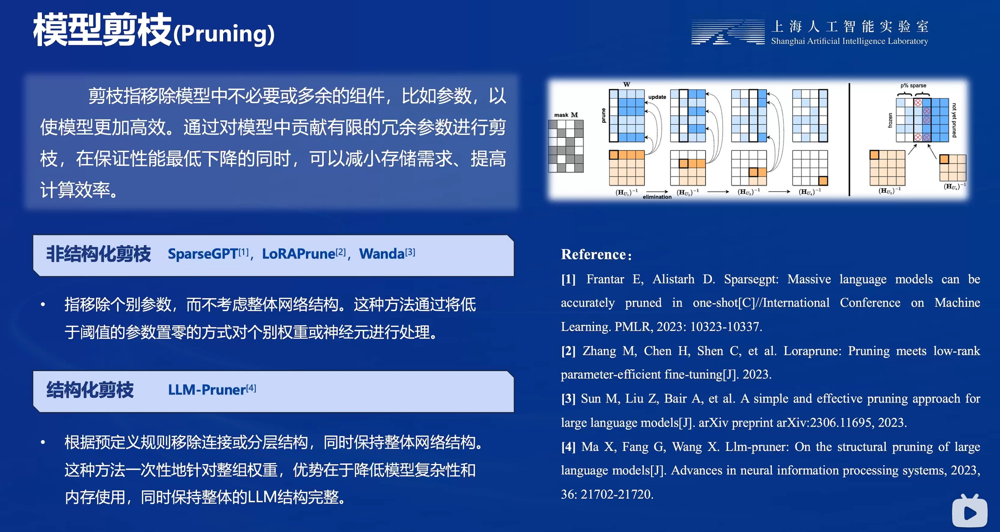

#【LMDeploy 量化部署 LLM&VLM实战】课程讲解

[课程视频]([url](https://www.bilibili.com/video/BV1tr421x75B/)
[课程文档]([url](https://github.com/InternLM/Tutorial/blob/camp2/lmdeploy/README.md))


### 模型加快推理速度的方法

- 模型剪枝（Pruning）



- 知识蒸馏（Knowledge Distillation, KD）


- Quantization  量化


 

# LMDeploy 介绍 

LMDeploy是涵盖了LLM 任务全套轻量化、部署和服务解决方案的集成功能包，TurboMind是LMDeploy的一个推理引擎，是一个子模块。LMDeploy也可以使用pytorch作为推理引擎。


### 核心功能

- 模型高效推理 参考命令：Imdeploy chat-h

TurboMind是LMDeploy团队开发的一款关于LLM 推理的高效推理引擎。它的主要功能包括：LLaMa结构模型的支持，
continuous batch推理模式和可扩展的KV缓存管理器。

- 模型量化压缩 参考命令：Imdeploy lite -h

W4A16量化（AWQ）：将FP16的模型权重量化为INT4，Kernel 计算时，访存量直接降为FP16模型的 1/4，大幅降低了访存
成本。Weight Only 是指仅量化权重，数值计算依然采用 FP16（需要将INT4 权重反量化）。

- 服务化部署 参考命令：Imdeploy serve-h

将LLM封装为HTTP API服务，支持Triton扩展。

- 对视觉模型支持

  ```python
  1 from Imdeploy import pipeline
  2 from Lmdeploy.vl import load_image
  3
  4 pipe = pipeline（'Liuhaotian/Llava-v1.6-vicuna-7b'）
  5
  
  6 image = load_image（'https://raw.githubusercontent.com/open-mmlab/mmdeploy/main/tests/data/tiger.jpeg'）
  7 response = pipe（（'describe this image'， image））
  8 print（response）
  ```

  


#### LMDeploy不仅支持运行InternLM系列大模型，还支持其他第三方大模型。支持的模型列表如下：

Model	Size
Llama	7B - 65B
Llama2	7B - 70B
InternLM	7B - 20B
InternLM2	7B - 20B
InternLM-XComposer	7B
QWen	7B - 72B
QWen-VL	7B
QWen1.5	0.5B - 72B
QWen1.5-MoE	A2.7B
Baichuan	7B - 13B
Baichuan2	7B - 13B
Code Llama	7B - 34B
ChatGLM2	6B
Falcon	7B - 180B
YI	6B - 34B
Mistral	7B
DeepSeek-MoE	16B
DeepSeek-VL	7B
Mixtral	8x7B
Gemma	2B-7B
Dbrx	132B

### LMDeploy模型对话(chat)

#### 1.Huggingface与TurboMind

##### HuggingFace

[HuggingFace](https://huggingface.co/)是一个高速发展的社区，包括Meta、Google、Microsoft、Amazon在内的超过5000家组织机构在为HuggingFace开源社区贡献代码、数据集和模型。可以认为是一个针对深度学习模型和数据集的在线托管社区，如果你有数据集或者模型想对外分享，网盘又不太方便，就不妨托管在HuggingFace。

托管在HuggingFace社区的模型通常采用HuggingFace格式存储，简写为**HF格式**。

但是HuggingFace社区的服务器在国外，国内访问不太方便。国内可以使用阿里巴巴的[MindScope](https://www.modelscope.cn/home)社区，或者上海AI Lab搭建的[OpenXLab](https://openxlab.org.cn/home)社区，上面托管的模型也通常采用**HF格式**。

##### TurboMind

TurboMind是LMDeploy团队开发的一款关于LLM推理的高效推理引擎，它的主要功能包括：LLaMa 结构模型的支持，continuous batch 推理模式和可扩展的 KV 缓存管理器。

TurboMind推理引擎仅支持推理TurboMind格式的模型。因此，TurboMind在推理HF格式的模型时，会首先自动将HF格式模型转换为TurboMind格式的模型。**该过程在新版本的LMDeploy中是自动进行的，无需用户操作。**

几个容易迷惑的点：

- TurboMind与LMDeploy的关系：LMDeploy是涵盖了LLM 任务全套轻量化、部署和服务解决方案的集成功能包，TurboMind是LMDeploy的一个推理引擎，是一个子模块。LMDeploy也可以使用pytorch作为推理引擎。
- TurboMind与TurboMind模型的关系：TurboMind是推理引擎的名字，TurboMind模型是一种模型存储格式，TurboMind引擎只能推理TurboMind格式的模型。


