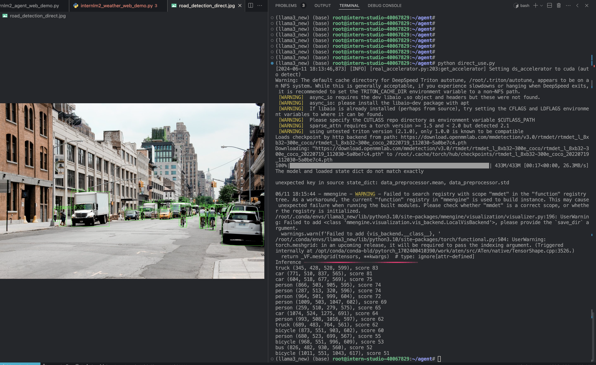
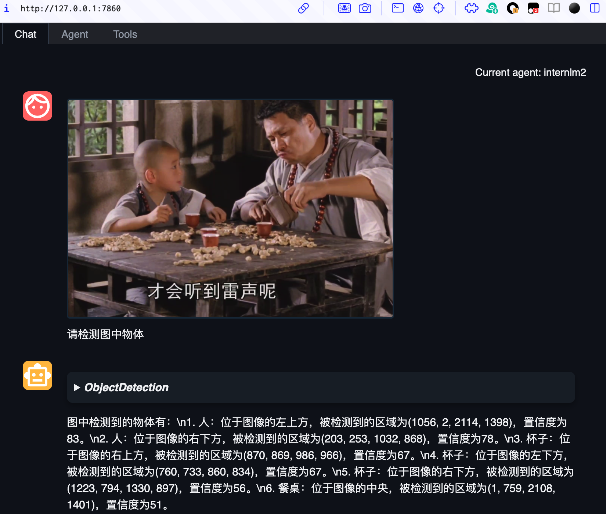

## 基础作业（结营必做）

#### 1.完成 Lagent Web Demo 使用，并在作业中上传截图。文档可见 [Lagent Web Demo](https://github.com/InternLM/Tutorial/blob/camp2/agent/lagent.md#1-lagent-web-demo)


#### 2. 完成 AgentLego 直接使用部分，并在作业中上传截图。文档可见 [直接使用 AgentLego](https://github.com/InternLM/Tutorial/blob/camp2/agent/agentlego.md#1-直接使用-agentlego)。

- 截图 



<details>
           <summary style="font-size:20">代码</summary>

-  执行命令

```bash
# AgentLego 所实现的目标检测工具是基于 mmdet (MMDetection) 算法库中的 RTMDet-Large 模型，因此我们首先安装 mim，然后通过 mim 工具来安装 mmdet。这一步所需时间可能会较长，请耐心等待。
pip install openmim==0.3.9
mim install mmdet==3.3.0

# 运行测试 
python  direct_use.py
```


- direct_user.py

```python
import re

import cv2
from agentlego.apis import load_tool

# load tool
tool = load_tool('ObjectDetection', device='cuda')

# apply tool
visualization = tool('/root/agent/road.jpg')
print(visualization)

# visualize
image = cv2.imread('/root/agent/road.jpg')

preds = visualization.split('\n')
pattern = r'(\w+) \((\d+), (\d+), (\d+), (\d+)\), score (\d+)'

for pred in preds:
    name, x1, y1, x2, y2, score = re.match(pattern, pred).groups()
    x1, y1, x2, y2, score = int(x1), int(y1), int(x2), int(y2), int(score)
    cv2.rectangle(image, (x1, y1), (x2, y2), (0, 255, 0), 1)
    cv2.putText(image, f'{name} {score}', (x1, y1), cv2.FONT_HERSHEY_SIMPLEX, 0.8, (0, 255, 0), 1)

cv2.imwrite('/root/agent/road_detection_direct.jpg', image)
```


</details>


## 进阶作业（优秀必做）


### 1.完成 AgentLego WebUI 使用，并在作业中上传截图。文档可见 [AgentLego WebUI](https://github.com/InternLM/Tutorial/blob/camp2/agent/agentlego.md#2-作为智能体工具使用)。


-    配置, 感觉目前之前很多的tool 
     
     


- 截图 




#### 2.使用 Lagent 或 AgentLego 实现自定义工具并完成调用，并在作业中上传截图。文档可见：

##### [用 Lagent 自定义工具](https://github.com/InternLM/Tutorial/blob/camp2/agent/lagent.md#2-用-lagent-自定义工具)


##### [用 AgentLego 自定义工具](https://github.com/InternLM/Tutorial/blob/camp2/agent/agentlego.md#3-用-agentlego-自定义工具)

- 图片识别 感觉肝脏之类的没有做训练(想看看医学上的通用性), 其他还不错.
  


 

> 测试 agent 功能没有问题, 虽然图片生成有些没实际用途....
> 

