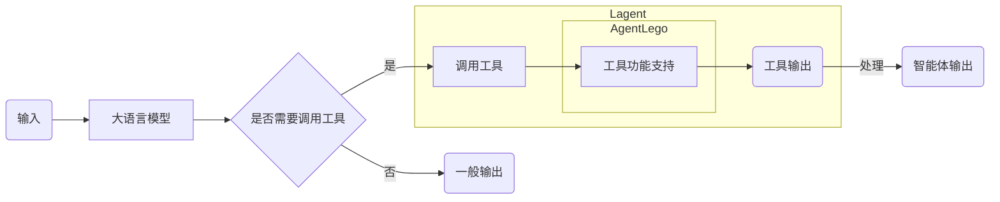

## 笔记

视频 https://www.bilibili.com/video/BV1Xt4217728/

**文档** https://github.com/InternLM/Tutorial/tree/camp2/agent

### 1. Lagent 简介
>  Lagent 轻量级智能体框架

- [ Lagent文档 ](https://lagent.readthedocs.io/zh-cn/latest/get_started/install.html)   
- demo 详细文档可以访问：
	- [Lagent：轻量级智能体框架](https://github.com/InternLM/Tutorial/blob/camp2/agent/lagent.md)。
	- [AgentLego：组装智能体“乐高”](https://github.com/InternLM/Tutorial/blob/camp2/agent/agentlego.md)。

##### [Agent 工具能力微调](https://github.com/InternLM/Tutorial/blob/camp2/agent/finetune.md)

## AgentLego

> AgentLego 是一个提供了多种开源工具 API 的多模态工具包，旨在像是乐高积木一样，让用户可以快速简便地拓展自定义工具，从而组装出自己的智能体。通过 AgentLego 算法库，不仅可以直接使用多种工具，也可以利用这些工具，在相关智能体框架（如 Lagent，Transformers Agent 等）的帮助下，快速构建可以增强大语言模型能力的智能体。

###  [agentlego 文档](https://agentlego.readthedocs.io/zh-cn/latest/get_started.html)

- [将 agentlego 工具集成到 LangChain 中：](https://agentlego.readthedocs.io/zh-cn/latest/get_started.html#id4) #langchain 
- [将 agentlego 工具集成到 Transformers agent 中：](https://agentlego.readthedocs.io/zh-cn/latest/get_started.html#transformers-agent)  #transformers_agent  #llm调用function 

## AgentLego 和 Agent 关系 

