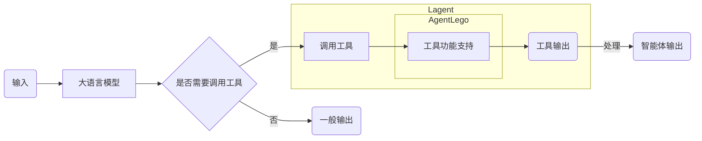

## 笔记

视频 https://www.bilibili.com/video/BV1Xt4217728/

**文档** https://github.com/InternLM/Tutorial/tree/camp2/agent


- conda 环境可以 这样?
```bash
conda activate /share/pre_envs/icamp3_rag 

```

### 1. Lagent 简介
>  Lagent 轻量级智能体框架

- [ Lagent文档 ](https://lagent.readthedocs.io/zh-cn/latest/get_started/install.html)   
- demo 详细文档可以访问：
	- [Lagent：轻量级智能体框架](https://github.com/InternLM/Tutorial/blob/camp2/agent/lagent.md)。
	- [AgentLego：组装智能体“乐高”](https://github.com/InternLM/Tutorial/blob/camp2/agent/agentlego.md)。


##### [Agent 工具能力微调](https://github.com/InternLM/Tutorial/blob/camp2/agent/finetune.md) 可以在自己的代码中根据模型的输出来实现调用函数的逻辑  
> 还没出来   2024-08-20 10:28


## AgentLego

> AgentLego 是一个提供了多种开源工具 API 的多模态工具包，旨在像是乐高积木一样，让用户可以快速简便地拓展自定义工具，从而组装出自己的智能体。通过 AgentLego 算法库，不仅可以直接使用多种工具，也可以利用这些工具，在相关智能体框架（如 Lagent，Transformers Agent 等）的帮助下，快速构建可以增强大语言模型能力的智能体。

###  [agentlego 文档](https://agentlego.readthedocs.io/zh-cn/latest/get_started.html)

- [将 agentlego 工具集成到 LangChain 中：](https://agentlego.readthedocs.io/zh-cn/latest/get_started.html#id4) #langchain 
- [将 agentlego 工具集成到 Transformers agent 中：](https://agentlego.readthedocs.io/zh-cn/latest/get_started.html#transformers-agent)  #transformers_agent  #llm调用function 


[LangChain](https://python.langchain.com/docs/get_started/introduction) 是一个用于创建利用语言模型的应用程序的框架。它提供了上下文感知和推理能力，为与语言模型一起使用和针对特定任务的预定义链提供了组件，使用户可以轻松地开始和自定义应用程序。

以下是一个示例脚本，将 agentlego 工具集成到 LangChain 中：
```python
from langchain import hub
from langchain.agents import create_structured_chat_agent, AgentExecutor
from langchain.memory import ConversationBufferMemory
from langchain_openai import ChatOpenAI
from agentlego.tools import Calculator

# 加载要使用的工具。
tools = [Calculator().to_langchain()]

# 构建 LangChain 智能体链

llm = ChatOpenAI(temperature=0.)
memory = ConversationBufferMemory(memory_key='chat_history', return_messages=True)
agent = create_structured_chat_agent(llm, tools, prompt=hub.pull("hwchase17/structured-chat-agent"))
agent_executor = AgentExecutor(agent=agent, tools=tools, memory=memory, verbose=True)

user_input = '如果三角形的边长分别为3cm、4cm和5cm，请用工具计算三角形的面积。'
agent_executor.invoke(dict(input=user_input))

```
### Transformers Agent[](https://agentlego.readthedocs.io/zh-cn/latest/get_started.html#transformers-agent)

[HuggingFace Transformers agent](https://huggingface.co/docs/transformers/transformers_agents) 是一个可扩展的自然语言 API，它理解用户输入并挑选工具进行操作。它允许轻松地集成由社区开发的其他工具。

以下是一个示例脚本，将 agentlego 工具集成到 Transformers agent 中：

```python
from transformers import HfAgent
from agentlego.tools import Calculator

# 加载要使用的工具
tools = [Calculator().to_transformers_agent()]

# 构建 Transformers Agent
prompt = open('examples/hf_agent/hf_demo_prompts.txt', 'r').read()
agent = HfAgent(
   'https://api-inference.huggingface.co/models/bigcode/starcoder',
   chat_prompt_template=prompt,
   additional_tools=tools,
)

user_input = '如果三角形的边长分别为3厘米、4厘米和5厘米，请告诉我三角形的面积。'
agent.chat(user_input)


```

## AgentLego 和 Agent 关系 





