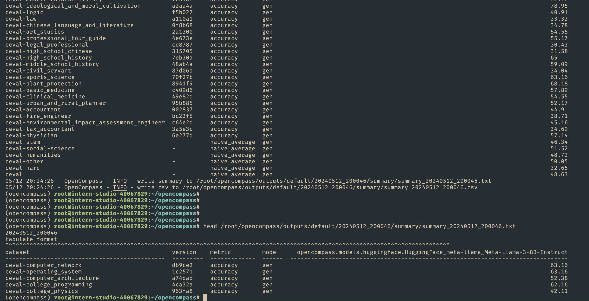

# OpenCompass评测 [OpenCompass github](https://github.com/open-compass/opencompass)

### 基础作业


- 使用 OpenCompass 评测 internlm2-chat-1_8b 模型在 C-Eval 数据集上的性能


升级到最新的opencompass( commit 833a35140b21a)    占用显存  23731MiB ,成功

```
 # 测试参考文档  https://github.com/SmartFlowAI/Llama3-Tutorial/blob/main/docs/opencompass.md
 python run.py --datasets ceval_gen --hf-path /root/model/Meta-Llama-3-8B-Instruct --tokenizer-path /root/model/Meta-Llama-3-8B-Instruct --tokenizer-kwargs padding_side='left' truncation='left' trust_remote_code=True --model-kwargs trust_remote_code=True device_map='auto' --max-seq-len 2048 --max-out-len 16 --batch-size 1 --num-gpus 1 --debug

# 结果 耗时大概1.5小时 

ceval-other                                     -          naive_average  gen                                                                                50.05
ceval-hard                                      -          naive_average  gen                                                                                32.65
ceval                                           -          naive_average  gen                                                                                48.63
05/12 20:24:26 - OpenCompass - INFO - write summary to /root/opencompass/outputs/default/20240512_200046/summary/summary_20240512_200046.txt
05/12 20:24:26 - OpenCompass - INFO - write csv to /root/opencompass/outputs/default/20240512_200046/summary/summary_20240512_200046.csv


```




### 进阶作业


- 将自定义数据集提交至OpenCompass官网

提交地址：[https://hub.opencompass.org.cn/dataset-submit?lang=[object%20Object\]](https://hub.opencompass.org.cn/dataset-submit?lang=[object Object])
提交指南：https://mp.weixin.qq.com/s/_s0a9nYRye0bmqVdwXRVCg
Tips：不强制要求配置数据集对应榜单（ leaderboard.xlsx ），可仅上传 README_OPENCOMPASS.md 文档


