# XTuner 微调 LLM：1.8B、多模态、Agent 
[文档](https://github.com/InternLM/Tutorial/tree/camp2/xtuner)

[XTuner 微调 LLM：1.8B、多模态、Agent  文档 初夏版]https://github.com/InternLM/Tutorial/blob/camp2/xtuner/personal_assistant_document.md

### finetune 介绍

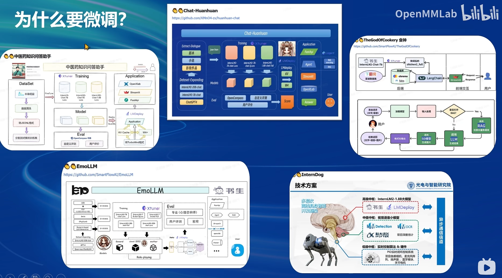


#### 两种Finetune范式

LLM 的下游应用中，增量预训练和指令跟随是经常会用到两种的微调模式

##### 增量预训练微调

使用场景：让基座模型学习到一些新知识，如某个垂类领域的常识
训练数据：文章、书籍、代码等

##### 指令跟随微调

使用场景：让模型学会对话模板，根据人类指令进行对话
训练数据：高质量的对话、问答数据


#### 对话 模板


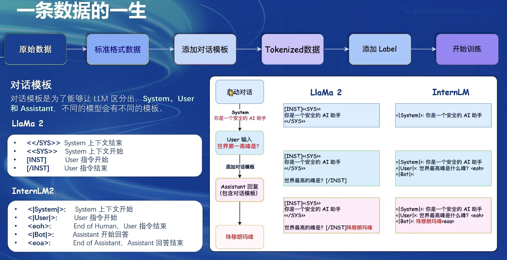

`<S>`作为起始符，`</S>`作为结束符

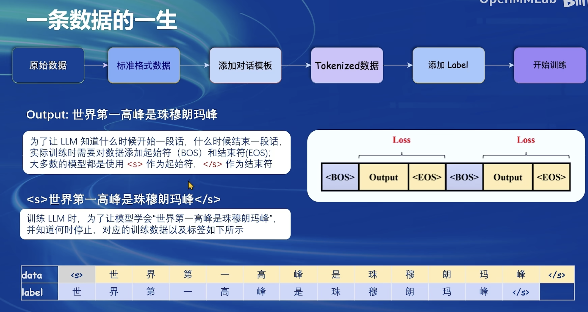

#### LoRA & QLORA

>    LoRA:   LOW-RANK ADAPTATION OF LARGE LANGUAGE MODELS

### [Xtuner](https://github.com/InternLM/Tutorial/)

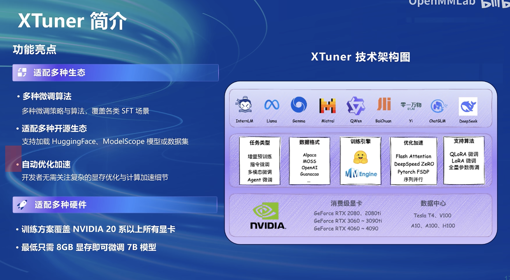


#### XTuner 快速上手


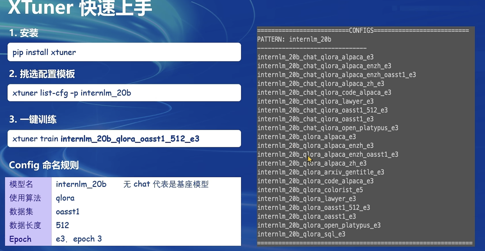


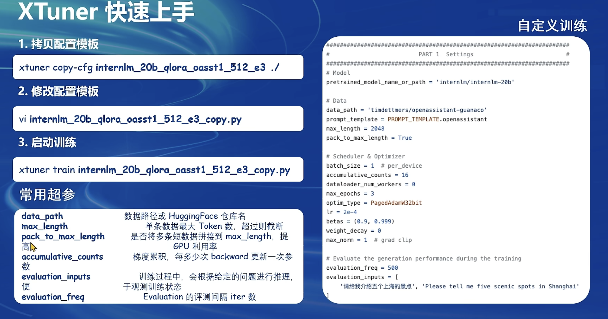


#### 用 xtuner  对话

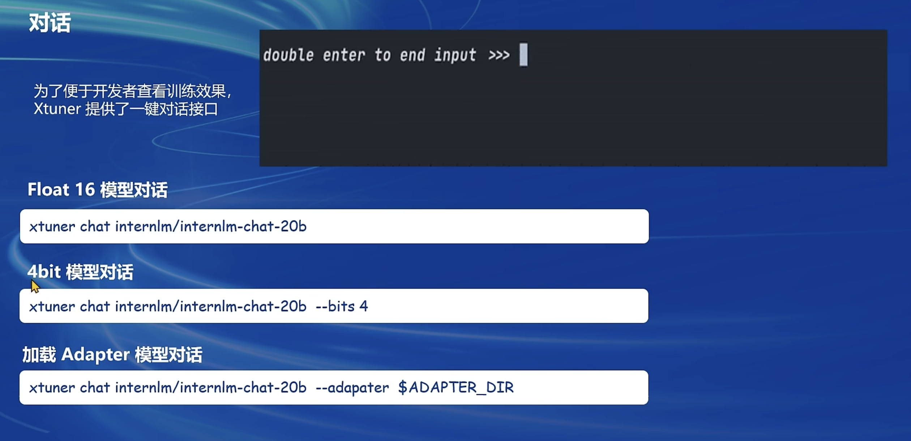

#### XTuner 还支持工具类模型的对话， 更多详见 HuggingFace Hub （xtuner/Llama-2-7b-qlora-moss-003-sft）

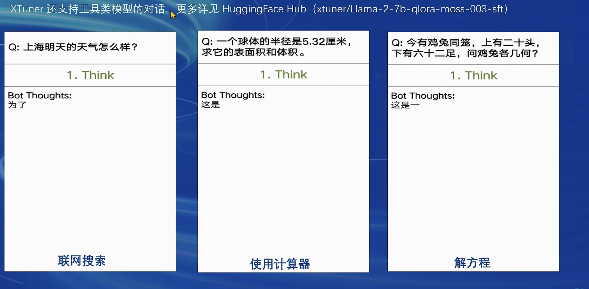

#### XTuner 数据引擎

##### XTuner 内置了多种热门数据集的映射函数

##### XTuner 内置了多种对话模板映射函数

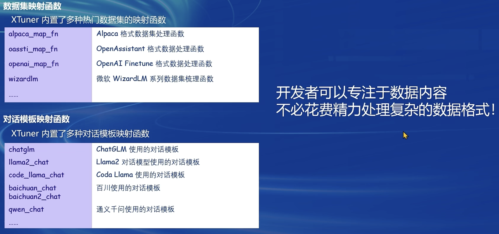

####  优化算法

##### Flash Attention

Flash Attention 将 Attention 计算并行化，避免了计算过程中 Attention Score NxN的显存占用（训练过程中的 N都比较大）


##### DeepSpeed ZeRO

ZeRO 优化，通过将训练过程中的参数、梯度和优化器状态切片保存，能够在多GPU 训练时显
著节省显存.除了将训练中间状态切片外，DeepSpeed 训练时使用FP16的权重，相较于 Pytorch 的AMP训练，
在单 GPU 上也能大幅节省显存


#### InternLM2 1.8B 模型

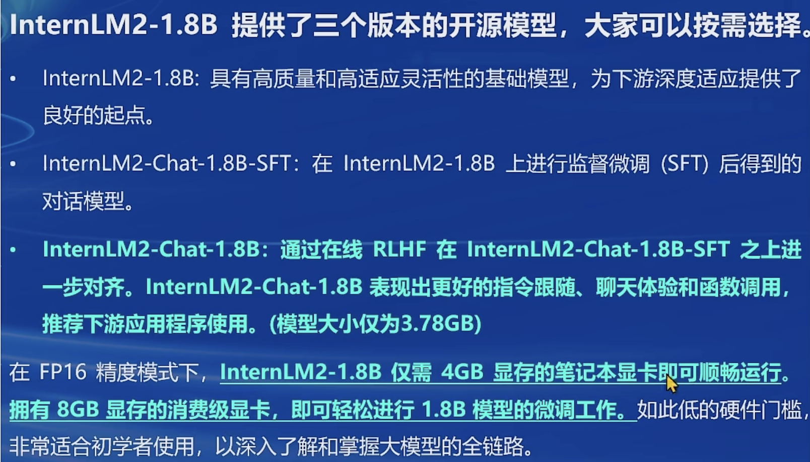


### 多模态LLM

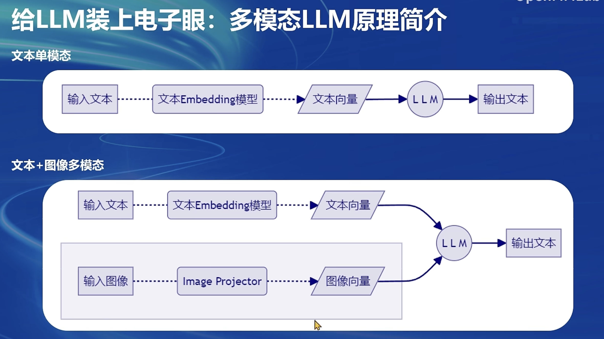


###  [XTuner 微调个人小助手部分](https://github.com/InternLM/Tutorial/blob/camp2/xtuner/personal_assistant_document.md)

> 微调 会自己测试结果 

> [!NOTE] 微调认知的步骤
> 1. 我们首先是在 GitHub 上克隆了 XTuner 的源码，并把相关的配套库也通过 pip 的方式进行了安装。
> 2. 然后我们根据自己想要做的事情，利用脚本准备好了一份关于调教模型认识自己身份弟位的数据集。
> 3. 再然后我们根据自己的显存及任务情况确定了使用 InternLM2-chat-1.8B 这个模型，并且将其复制到我们的文件夹里。
> 4. 最后我们在 XTuner 已有的配置文件中，根据微调方法、数据集和模型挑选出最合适的配置文件并复制到我们新建的文件夹中。


- XTuner 提供多个开箱即用的配置文件，用户可以通过下列命令查看：

开箱即用意味着假如能够连接上 Huggingface 以及有足够的显存，其实就可以直接运行这些配置文件，XTuner就能够直接下载好这些模型和数据集然后开始进行微调
```
# 列出所有内置配置文件
# xtuner list-cfg

# 假如我们想找到 internlm2-1.8b 模型里支持的配置文件
xtuner list-cfg -p internlm2_1_8b
```

- 使用 deepspeed 来加速训练 
```bash
# 使用 deepspeed 来加速训练
xtuner train /root/ft/config/internlm2_1_8b_qlora_alpaca_e3_copy.py --work-dir /root/ft/train_deepspeed --deepspeed deepspeed_zero2

```


#### 使用模型验证 测试微调结果

- 最终输出


```bash
04/12 11:57:11 - mmengine - INFO - Iter(train) [720/768]  lr: 2.1272e-06  eta: 0:00:27  time: 0.7224  data_time: 0.0059  memory: 5661  loss: 0.0103
04/12 11:57:18 - mmengine - INFO - Iter(train) [730/768]  lr: 1.3493e-06  eta: 0:00:21  time: 0.7234  data_time: 0.0056  memory: 5661  loss: 0.0132
04/12 11:57:25 - mmengine - INFO - Iter(train) [740/768]  lr: 7.4681e-07  eta: 0:00:16  time: 0.7251  data_time: 0.0058  memory: 5661  loss: 0.0127
04/12 11:57:32 - mmengine - INFO - Iter(train) [750/768]  lr: 3.2080e-07  eta: 0:00:10  time: 0.7275  data_time: 0.0070  memory: 5661  loss: 0.0091
04/12 11:57:40 - mmengine - INFO - Iter(train) [760/768]  lr: 7.2010e-08  eta: 0:00:04  time: 0.7342  data_time: 0.0071  memory: 5661  loss: 0.0178
04/12 11:57:46 - mmengine - INFO - after_train_iter in EvaluateChatHook.
04/12 11:57:47 - mmengine - INFO - Sample output:
<s><|User|>:请你介绍一下你自己
<|Bot|>:我是jzy的小助手，内在是上海AI实验室书生·浦语的1.8B大模型哦</s>

04/12 11:57:48 - mmengine - INFO - Sample output:
<s><|User|>:你是谁
<|Bot|>:我是jzy的小助手，内在是上海AI实验室书生·浦语的1.8B大模型哦</s>

04/12 11:57:49 - mmengine - INFO - Sample output:
<s><|User|>:你是我的小助手吗
<|Bot|>:是的</s>


```
- xtuner 内置 模型进行对话
```bash
# 与模型进行对话
xtuner chat /root/ft/final_model --prompt-template internlm2_chat

```

### 图像微调测试 

#### 测试步骤
LLaVA方案中，给LLM增加视觉能力的过程，即是训练Image Projector文件的过程。 该过程分为2个阶段：Pretrain(粗看,需要强GPU ,有8卡A100)和Finetune(1.8B模型 24G显存,8B模型大概45G显存 )。


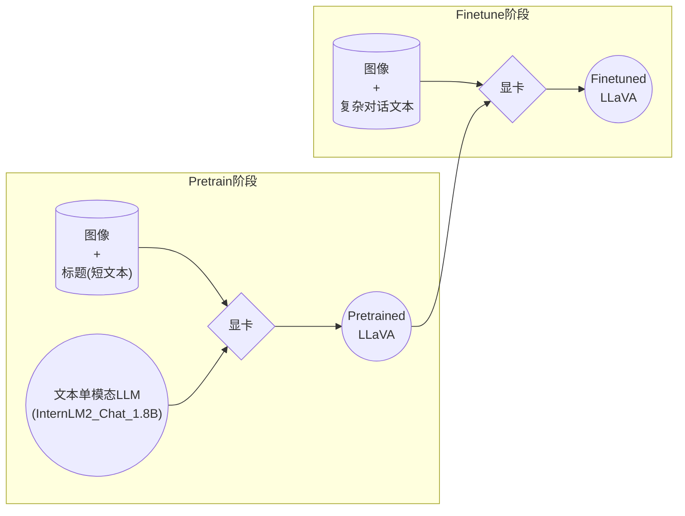
- Finetune阶段

在Finetune阶段，我们会使用图片+复杂文本数据对，来对Pretrain得到的Image Projector即iter_2181.pth进行进一步的训练。
<details>
<summary>示例</summary>

```json
[
  {
    "id": "000000033471",
    "image": "coco/train2017/000000033471.jpg",
    "conversations": [
      {
        "from": "human",
        "value": "<image>\nWhat are the colors of the bus in the image?"
      },
      {
        "from": "gpt",
        "value": "The bus in the image is white and red."
      },
      {
        "from": "human",
        "value": "What feature can be seen on the back of the bus?"
      },
      {
        "from": "gpt",
        "value": "The back of the bus features an advertisement."
      },
      {
        "from": "human",
        "value": "Is the bus driving down the street or pulled off to the side?"
      },
      {
        "from": "gpt",
        "value": "The bus is driving down the street, which is crowded with people and other vehicles."
      }
    ]
  },
  {
    "id": "000000052846",
    "image": "coco/train2017/000000052846.jpg",
    "conversations": [
      {
        "from": "human",
        "value": "<image>\nWhere is the cat positioned in the image?"
      },
      {
        "from": "gpt",
        "value": "The cat is positioned on top of the back of the couch in the living room."
      }
    ]
  }
 ]
```

</details>
我们可以效法LLaVA作者的做法，将自己的图片发送给GPT，要求其按照上述格式生成若干条问答对。

<details>
<summary>prompts</summary>

Create a dataset for me, following this format.
```json
[
  {
    "id": "<random_number_string>",
    "image": "test_img/oph.jpg",
    "conversations": [
      {
        "from": "human",
        "value": "<image>\nDescribe this image."
      },
      {
        "from": "gpt",
        "value": "<answer1>"
      },
      {
        "from": "human",
        "value": "<question2>"
      },
      {
        "from": "gpt",
        "value": "<answer2>"
      },
      {
        "from": "human",
        "value": "<question3>"
      },
      {
        "from": "gpt",
        "value": "<answer3>"
      }
    ]
  }
]
```
The questions and answers, please generate for me, based on the image I sent to you. Thes questions should be from the shallow to the deep, and the answers should be as detailed and correct as possible. The questions and answers should be stick to the contents in the image itself, like objects, peoples, equipment, environment, purpose, color, attitude, etc. 5 question and answer pairs.
</details>
<br>

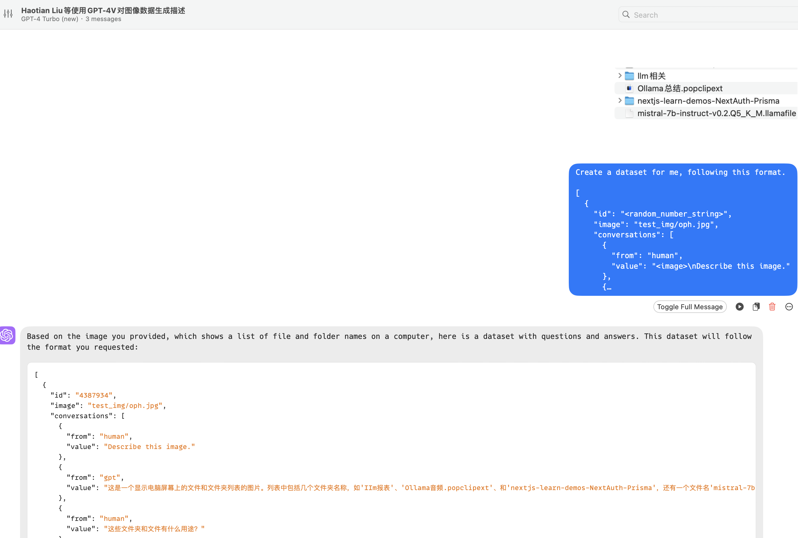

####  Pretain

Pretrain阶段相当于是开发LLM时预训练工作，对硬件要求非常高，有8卡的学有余力同学可以自行尝试。详见XTuner-LLaVA和LLaVA。

```bash


NPROC_PER_NODE=8 xtuner train llava_internlm2_chat_1_8b_clip_vit_large_p14_336_e1_gpu8_pretrain --deepspeed deepspeed_zero2

NPROC_PER_NODE=8 xtuner train llava_internlm2_chat_1_8b_qlora_clip_vit_large_p14_336_lora_e1_gpu8_finetune --deepspeed deepspeed_zero2
```


#### Finetune 微调实战 
- 下载项目  `/root/tutorial`
```
cd ~ && git clone https://github.com/InternLM/tutorial -b camp2 && conda activate xtuner0.1.17 && cd tutorial

```

- `/root/tutorial/xtuner/llava/`目录下的文件结构应该是这样：
  - [llava_internlm2_chat_1_8b_qlora_clip_vit_large_p14_336_lora_e1_gpu8_finetune_copy.py](./llava_internlm2_chat_1_8b_qlora_clip_vit_large_p14_336_lora_e1_gpu8_finetune_copy.py)


```bash
|-- llava_data
|   |-- repeat.py
|   |-- repeated_data.json
|   |-- test_img
|   |   `-- oph.jpg
|   `-- unique_data.json
`-- llava_internlm2_chat_1_8b_qlora_clip_vit_large_p14_336_lora_e1_gpu8_finetune_copy.py
```


-  查询xtuner内置配置文件
```
xtuner list-cfg -p llava_internlm2_chat_1_8b
```

- 训练数据
```bash
cd /root/tutorial/xtuner/llava/
xtuner train /root/tutorial/xtuner/llava/llava_internlm2_chat_1_8b_qlora_clip_vit_large_p14_336_lora_e1_gpu8_finetune_copy.py --deepspeed deepspeed_zero2
```


##### 验证结果 对比Finetune前后的性能差异
- LLaVA测试阶段示意图
visual_encoder_name_or_path  Visual Encoder 权重
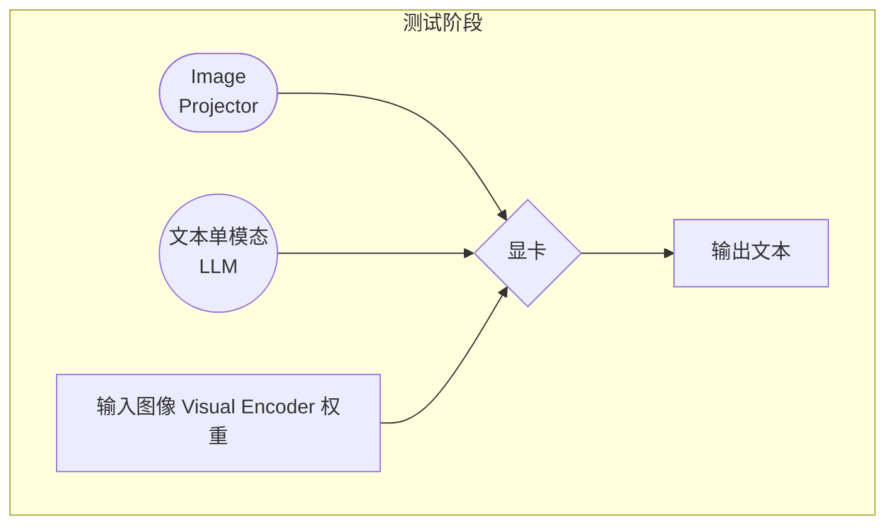

######  Finetune前

> 即：**加载 1.8B 和 Pretrain阶段产物(iter_2181) 到显存。**

```bash
# 解决小bug
export MKL_SERVICE_FORCE_INTEL=1
export MKL_THREADING_LAYER=GNU

# pth转huggingface
xtuner convert pth_to_hf \
  llava_internlm2_chat_1_8b_clip_vit_large_p14_336_e1_gpu8_pretrain \
  /root/share/new_models/xtuner/iter_2181.pth \
  /root/tutorial/xtuner/llava/llava_data/iter_2181_hf

# 启动！
xtuner chat /root/share/new_models/Shanghai_AI_Laboratory/internlm2-chat-1_8b \
  --visual-encoder /root/share/new_models/openai/clip-vit-large-patch14-336 \
  --llava /root/tutorial/xtuner/llava/llava_data/iter_2181_hf \
  --prompt-template internlm2_chat \
  --image /root/tutorial/xtuner/llava/llava_data/test_img/oph.jpg
```

###### Finetune后

> 即：**加载 1.8B 和 Fintune阶段产物 到显存。**

```bash
# 解决小bug
export MKL_SERVICE_FORCE_INTEL=1
export MKL_THREADING_LAYER=GNU

# pth转huggingface
#xtuner convert pth_to_hf 参数:
#  config                config file name or path.
#  pth_model             pth model file
#  save_dir              the directory to save HuggingFace model


xtuner convert pth_to_hf \
  /root/tutorial/xtuner/llava/llava_internlm2_chat_1_8b_qlora_clip_vit_large_p14_336_lora_e1_gpu8_finetune_copy.py \
  /root/tutorial/xtuner/llava/work_dirs/llava_internlm2_chat_1_8b_qlora_clip_vit_large_p14_336_lora_e1_gpu8_finetune_copy/iter_1200.pth \
  /root/tutorial/xtuner/llava/llava_data/iter_1200_hf

# 启动！
xtuner chat /root/share/new_models/Shanghai_AI_Laboratory/internlm2-chat-1_8b \
  --visual-encoder /root/share/new_models/openai/clip-vit-large-patch14-336 \
  --llava /root/tutorial/xtuner/llava/llava_data/iter_1200_hf \
  --prompt-template internlm2_chat \
  --image /root/tutorial/xtuner/llava/llava_data/test_img/oph.jpg
```

- 输出结果:


## 文档 
<details>
<summary><b>常用超参等参数介绍</b></summary>

**常用超参**

| 参数名                  | 解释                                                     |
| ----------------------- | -------------------------------------------------------- |
| **data_path**           | 数据路径或 HuggingFace 仓库名                             |
| **max_length**          | 单条数据最大 Token 数，超过则截断                         |
| **pack_to_max_length**  | 是否将多条短数据拼接到 max_length，提高 GPU 利用率        |
| **accumulative_counts** | 梯度累积，每多少次 backward 更新一次参数                  |
| **sequence_parallel_size** | 并行序列处理的大小，用于模型训练时的序列并行              |
| **batch_size**          | 每个设备上的批量大小                                      |
| **dataloader_num_workers** | 数据加载器中工作进程的数量                                |
| **max_epochs**          | 训练的最大轮数                                             |
| **optim_type**          | 优化器类型，例如 AdamW                                    |
| **lr**                  | 学习率                                                    |
| **betas**               | 优化器中的 beta 参数，控制动量和平方梯度的移动平均         |
| **weight_decay**        | 权重衰减系数，用于正则化和避免过拟合                      |
| **max_norm**            | 梯度裁剪的最大范数，用于防止梯度爆炸                      |
| **warmup_ratio**        | 预热的比例，学习率在这个比例的训练过程中线性增加到初始学习率 |
| **save_steps**          | 保存模型的步数间隔                                         |
| **save_total_limit**    | 保存的模型总数限制，超过限制时删除旧的模型文件             |
| **prompt_template**     | 模板提示，用于定义生成文本的格式或结构                    |
| ...... | ...... |

> 如果想把显卡的现存吃满，充分利用显卡资源，可以将 `max_length` 和 `batch_size` 这两个参数调大。
</details>

### 参考 llama3 的微调 [ref](https://github.com/SmartFlowAI/Llama3-Tutorial/blob/main/docs/agent.md)

- 权重转换为 HuggingFace 格式，并合并到原权重中。

```bash
# 转换权重
xtuner convert pth_to_hf ~/Llama3-Tutorial/configs/llama3-agentflan/llama3_8b_instruct_qlora_agentflan_3e.py \
    ~/llama3_agent_pth/iter_18516.pth \
    ~/llama3_agent_pth/iter_18516_hf
```

- 指令合并权重：

```bash
export MKL_SERVICE_FORCE_INTEL=1
xtuner convert merge /root/model/Meta-Llama-3-8B-Instruct \
    /share/new_models/agent-flan/iter_2316_hf \
    ~/llama3_agent_pth/merged
```

###  运行微调后的模型 Lagent Web Demo


因为我们在微调前后都需要启动 Web Demo 以观察效果，因此我们将 Web Demo 部分单独拆分出来。

首先我们先来安装 lagent。

```
pip install lagent
```


然后我们使用如下指令启动 Web Demo：

```
streamlit run ~/Llama3-Tutorial/tools/agent_web_demo.py 微调前/后 LLaMA3 模型路径
```

