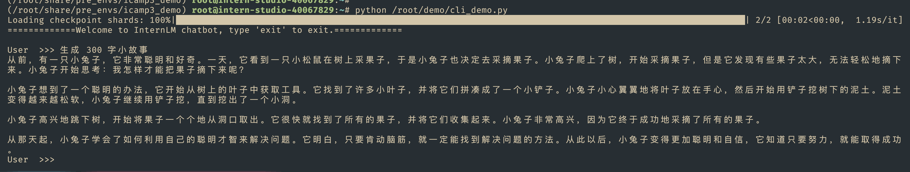
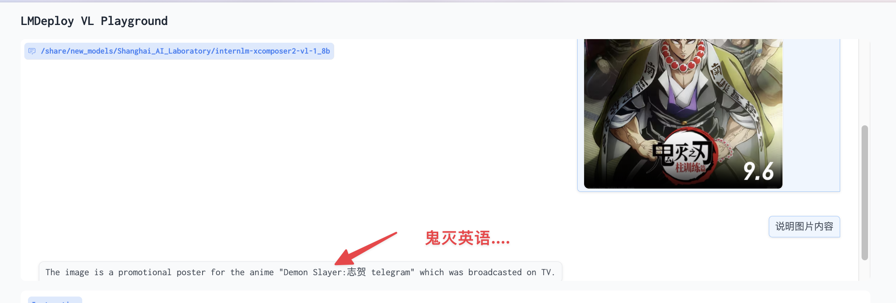
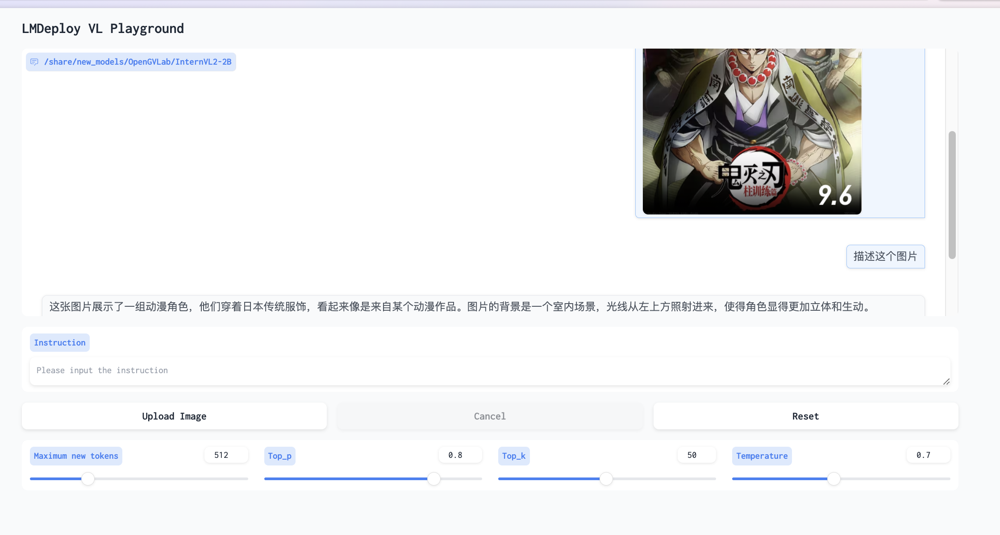

# [8G 显存玩转书生大模型 Demo](https://github.com/InternLM/Tutorial/blob/camp3/docs/L1/Demo/easy_readme.md)


## 基础任务（完成此任务即完成闯关）

- 使用 Cli Demo 完成 InternLM2-Chat-1.8B 模型的部署，并生成 300 字小故事，记录复现过程并截图。



## 进阶任务（闯关不要求完成此任务）

### 使用 LMDeploy 完成 InternLM-XComposer2-VL-1.8B 的部署，并完成一次图文理解对话，记录复现过程并截图。

> InternLM-XComposer2 是一款基于 InternLM2 的视觉语言大模型，其擅长自由形式的文本图像合成和理解


```bash
conda activate /root/share/pre_envs/icamp3_demo

# cache-max-entry-count  gpu剩余内存中键值缓存占用的百分比 (gpu memory occupied by the k/v cache)，不包括权重。默认：0.8。类型：float
lmdeploy serve gradio /share/new_models/Shanghai_AI_Laboratory/internlm-xcomposer2-vl-1_8b --cache-max-entry-count 0.1
```





### 使用 LMDeploy 完成 InternVL2-2B 的部署，并完成一次图文理解对话，记录复现过程并截图。

> InternVL2 是上海人工智能实验室推出的新一代视觉-语言多模态大模型


```bash
lmdeploy serve gradio /share/new_models/OpenGVLab/InternVL2-2B --cache-max-entry-count 0.1

```

- top-k 较高的k值意味着模型会从更广泛的词汇库中选择单词





## 闯关材料提交（完成任务并且提交材料视为闯关成功）
- 闯关作业总共分为一个任务，一个任务完成视作闯关成功。
- 请将作业发布到知乎、CSDN等任一社交媒体，将作业链接提交到以下问卷，助教老师批改后将获得 100 算力点奖励！！！ 
- 提交地址：https://aicarrier.feishu.cn/share/base/form/shrcnZ4bQ4YmhEtMtnKxZUcf1vd
