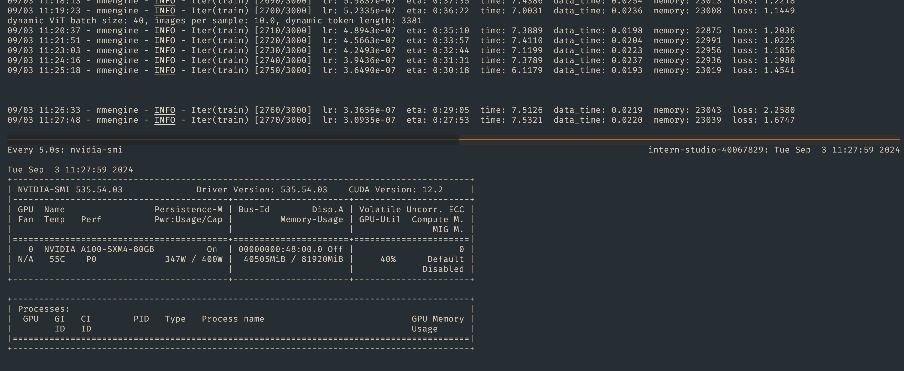
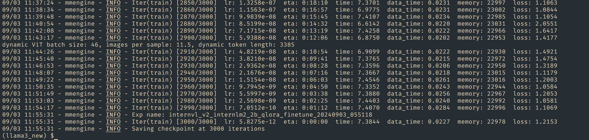
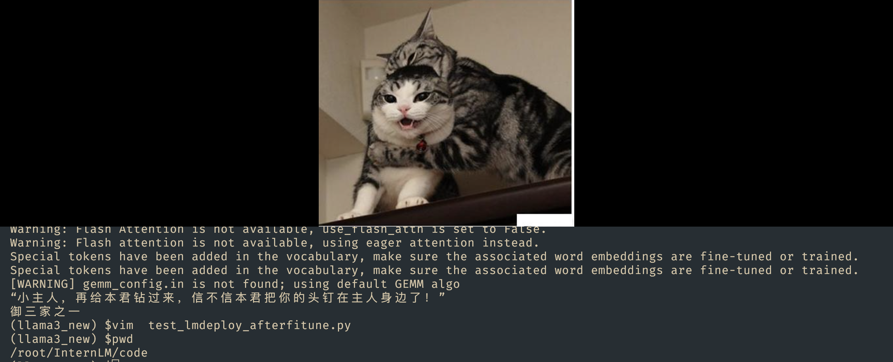

## **基础任务（完成此任务即完成闯关）**

- follow 教学文档和视频使用QLoRA进行微调模型，复现微调效果，并能成功讲出梗图.
- 尝试使用LoRA，或调整xtuner的config，如LoRA rank，学习率。看模型Loss会如何变化，并记录调整后效果(选做，使用LoRA或调整config可以二选一)


### 准备微调数据集
- zhongshsh/CLoT-Oogiri-GO据集
```bash
cp -r /root/share/new_models/datasets/CLoT_cn_2000 /root/InternLM/datasets/

```
### InternVL 微调
- 下载 xtuner
```bash
cd /root/InternLM/code/XTuner

```

- 修改微调参数  /root/InternLM/code/XTuner/xtuner/configs/internvl/v2/internvl_v2_internlm2_2b_qlora_finetune.py
	- 数据集 位置` data_root = '/root/InternLM/datasets/CLoT_cn_2000/'
	- 模型 改成 `path = /root/model/InternVL2-2B`
	-  prompt_template = PROMPT_TEMPLATE.internlm2_chat
	
```bash
>>> prompt_template = PROMPT_TEMPLATE.internlm2_chat
>>>
>>> prompt_template
{'SYSTEM': '<|im_start|>system\n{system}<|im_end|>\n', 'INSTRUCTION': '<|im_start|>user\n{input}<|im_end|>\n<|im_start|>assistant\n', 'SUFFIX': '<|im_end|>', 'SUFFIX_AS_EOS': True, 'SEP': '\n', 'STOP_WORDS': ['<|im_end|>']}
	
```

-  运行 ==从 05:51:56 运行到 12点..... 6个小时  , 40G GPU == 大概6个小时....
```bash


NPROC_PER_NODE=1 xtuner train /root/InternLM/code/XTuner/xtuner/configs/internvl/v2/internvl_v2_internlm2_2b_qlora_finetune.py  --work-dir /root/InternLM/work_dir/internvl_ft_run_8_filter  --deepspeed deepspeed_zero1

```




- 训练完成 
checkpoint 保存在  `/root/InternLM/work_dir/internvl_ft_run_8_filter/iter_3000.pth



#### 合并权重&&模型转换
合并模型 :/root/InternLM/InternVL2-2B/


```bash
cd /root/InternLM/code/XTuner

python3 xtuner/configs/internvl/v1_5/convert_to_official.py  xtuner/configs/internvl/v2/internvl_v2_internlm2_2b_qlora_finetune.py /root/InternLM/work_dir/internvl_ft_run_8_filter/iter_3000.pth /root/InternLM/InternVL2-2B/

```

```bash
drwxr-xr-x 2 root root       4096 Sep  3 12:00 ./
drwxr-xr-x 8 root root       4096 Sep  3 11:59 ../
-rw-r--r-- 1 root root        179 Sep  3 12:00 added_tokens.json
-rw-r--r-- 1 root root       5460 Sep  3 11:59 config.json
-rw-r--r-- 1 root root       5547 Sep  3 11:59 configuration_intern_vit.py
-rw-r--r-- 1 root root       7005 Sep  3 11:59 configuration_internlm2.py
-rw-r--r-- 1 root root       3846 Sep  3 11:59 configuration_internvl_chat.py
-rw-r--r-- 1 root root      14995 Sep  3 11:59 conversation.py
-rw-r--r-- 1 root root         69 Sep  3 11:59 generation_config.json
-rw-r--r-- 1 root root 4411571040 Sep  3 12:00 model.safetensors
-rw-r--r-- 1 root root      18201 Sep  3 11:59 modeling_intern_vit.py
-rw-r--r-- 1 root root      61208 Sep  3 11:59 modeling_internlm2.py
-rw-r--r-- 1 root root      15246 Sep  3 11:59 modeling_internvl_chat.py
-rw-r--r-- 1 root root        844 Sep  3 12:00 special_tokens_map.json
-rw-r--r-- 1 root root       8791 Sep  3 12:00 tokenization_internlm2.py
-rw-r--r-- 1 root root    1477754 Sep  3 12:00 tokenizer.model
-rw-r--r-- 1 root root       4005 Sep  3 12:00 tokenizer_config.json
(llama3_new) $pwd
/root/InternLM/InternVL2-2B

```

-  用新模型 测试 


- test_Imdeploy_afterfitune.py 
```python
from lmdeploy import pipeline
from lmdeploy.vl import load_image

pipe = pipeline('/root/InternLM/InternVL2-2B')

image = load_image('/root/InternLM/007aPnLRgy1hb39z0im50j30ci0el0wm.jpg')
response = pipe(('请你根据这张图片，讲一个脑洞大开的梗', image))
print(response.text)
```


## 学习 
[任务](https://github.com/InternLM/Tutorial/blob/camp3/docs/L2/InternVL/task.md)、[文档](https://github.com/InternLM/Tutorial/blob/camp3/docs/L2/InternVL)、[视频](https://www.bilibili.com/video/BV1N6p1eXETX/)

