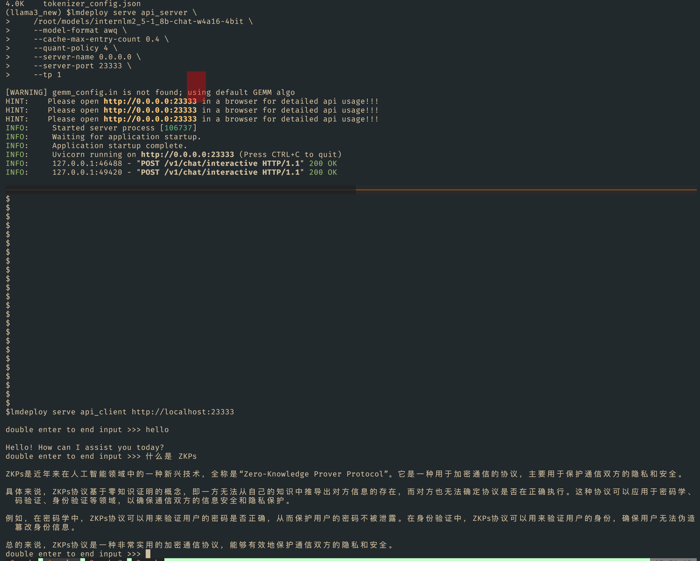
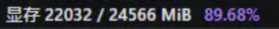

## **基础任务（完成此任务即完成闯关）**

[任务](https://github.com/InternLM/Tutorial/blob/camp3/docs/L2/LMDeploy/task.md)、[文档](https://github.com/InternLM/Tutorial/blob/camp3/docs/L2/LMDeploy/readme.md)、[视频](https://www.bilibili.com/video/BV1df421q7cR/)

- 使用结合W4A16量化与kv cache量化的`internlm2_5-1_8b-chat`模型封装本地API并与大模型进行一次对话，作业截图需包括显存占用情况与大模型回复，参考4.1 API开发(优秀学员必做)，**请注意2.2.3节与4.1节应使用作业版本命令。**


<details>
           <summary style="font-size:20"> 执行步骤 </summary> 
#### 1.使用W4A16量化 模型到 /root/models/internlm2_5-1_8b-chat-w4a16-4bit
-  **LMDeploy Lite模型压缩**
```bash
# 2个小时感觉 
lmdeploy lite auto_awq \
   /root/models/internlm2_5-1_8b-chat \
  --calib-dataset 'ptb' \
  --calib-samples 128 \
  --calib-seqlen 2048 \
  --w-bits 4 \
  --w-group-size 128 \
  --batch-size 1 \
  --search-scale False \
  --work-dir /root/models/internlm2_5-1_8b-chat-w4a16-4bit
```


#### 2.服务端启动

```bash
lmdeploy serve api_server \
    /root/models/internlm2_5-1_8b-chat-w4a16-4bit \
    --model-format awq \
    --cache-max-entry-count 0.4 \
    --quant-policy 4 \
    --server-name 0.0.0.0 \
    --server-port 23333 \
    --tp 1

```
#### 3.命令行客户端
```bash
lmdeploy serve api_client http://localhost:23333
```
</details>
##### 截图

- **设置在线 kv cache int4/int8 量化**
通过 LMDeploy 应用 kv 量化非常简单，只需要设定 `quant_policy` 和`cache-max-entry-count`参数。目前，LMDeploy 规定 `qant_policy=4` 表示 kv int4 量化，`quant_policy=8` 表示 kv int8 量化

- 命令行 启动服务端 和客户端 



#### api API开发


<details>
           <summary style="font-size:20"> 代码 </summary> 


  [interlm2_5_openai.py](../python/internlm2_5__202409.py)

```python
# 导入openai模块中的OpenAI类，这个类用于与OpenAI API进行交互
#https://github.com/InternLM/Tutorial/blob/camp3/docs/L2/LMDeploy/readme.md#3.2
from openai import OpenAI


# 创建一个OpenAI的客户端实例，需要传入API密钥和API的基础URL
client = OpenAI(
    api_key='YOUR_API_KEY',  
    # 替换为你的OpenAI API密钥，由于我们使用的本地API，无需密钥，任意填写即可
    base_url="http://0.0.0.0:23333/v1"  
    # 指定API的基础URL，这里使用了本地地址和端口
)

# 调用client.models.list()方法获取所有可用的模型，并选择第一个模型的ID
# models.list()返回一个模型列表，每个模型都有一个id属性
model_name = client.models.list().data[0].id

# 使用client.chat.completions.create()方法创建一个聊天补全请求
# 这个方法需要传入多个参数来指定请求的细节
response = client.chat.completions.create(
  model=model_name,  
  # 指定要使用的模型ID
  messages=[  
  # 定义消息列表，列表中的每个字典代表一个消息
    {"role": "system", "content": "你是一个友好的小助手，负责解决问题."},  
    # 系统消息，定义助手的行为
    {"role": "user", "content": "帮我讲述一个关于狐狸和西瓜的小故事"},  
    # 用户消息，询问时间管理的建议
  ],
    temperature=0.8,  
    # 控制生成文本的随机性，值越高生成的文本越随机
    top_p=0.8  
    # 控制生成文本的多样性，值越高生成的文本越多样
)

# 打印出API的响应结果
print(response.choices[0].message.content)


```

</details>


###  使用Function call功能让大模型完成一次简单的"加"与"乘"函数调用，作业截图需包括大模型回复的工具调用情况，参考4.2 Function call(选做)

- 模型用 internlm2_5-7b-chat
```
lmdeploy serve api_server \
    /root/models/internlm2_5-7b-chat \
    --model-format hf \
    --quant-policy 0 \
    --server-name 0.0.0.0 \
    --server-port 23333 \
    --tp 1
```


-  `(3+5)*2`截图
	- 先计算加法
	- 再计算乘法


## 知识点 参考 [zhuanlan.zhihu.com/p/714196505](https://zhuanlan.zhihu.com/p/714196505)
###  **3.LMDeploy Lite模型压缩**

#### **1）设置最大kv cache缓存大小**

LMDeploy的kv cache管理器可以通过设置`--cache-max-entry-count`参数，控制kv缓存占用**剩余显存**的最大比例。默认的比例为0.8。现在设置 --cache-max-entry-count 0.4。

```text
lmdeploy chat /root/models/internlm2_5-7b-chat --cache-max-entry-count 0.4
```


查看显存使用率


修改kv cache占用之后的显存占用情况(**19GB**)：
1、与上述声明一致，在 BF16 精度下，7B模型权重占用**14GB**
2、kv cache占用**4GB**：剩余显存**24-14=10GB**，kv cache修改为占用40%，即**10*0.4=4GB**
3、其他项**1GB**

是故**19GB**=权重占用**14GB**+kv cache占用**4GB**+其它项**1GB**

#### **2）设置在线 kv cache int4/int8 量化**

通过 LMDeploy 应用 kv 量化非常简单，只需要设定 `quant_policy` 和`cache-max-entry-count`参数。目前，LMDeploy 规定 `qant_policy=4` 表示 kv int4 量化，`quant_policy=8` 表示 kv int8 量化。

```text
lmdeploy serve api_server \
    /root/models/internlm2_5-7b-chat \
    --model-format hf \
    --quant-policy 4 \
    --cache-max-entry-count 0.4\
    --server-name 0.0.0.0 \
    --server-port 23333 \
    --tp 1
```


显存使用率为


#### **3）W4A16 模型量化和部署**

模型量化是一种[优化技术](https://zhida.zhihu.com/search?q=%E4%BC%98%E5%8C%96%E6%8A%80%E6%9C%AF&zhida_source=entity&is_preview=1)，旨在减少机器学习模型的大小并提高其推理速度。量化通过将模型的权重和激活从高精度（如16位浮点数）转换为低精度（如8位整数、4位整数、甚至二值网络）来实现。

- W4：这通常表示**权重量化为4位整数（int4）**。这意味着模型中的权重参数将从它们原始的浮点表示（例如FP32、BF16或FP16，**Internlm2.5精度为BF16**）转换为4位的整数表示。**这样做可以显著减少模型的大小。**
- A16：这表示**激活（或输入/输出）仍然保持在16位浮点数**（例如FP16或BF16）。激活是在神经网络中传播的数据，通常在每层运算之后产生。

因此，W4A16的量化配置意味着：

- 权重被量化为4位整数。
- 激活保持为16位浮点数。

```text
lmdeploy lite auto_awq \
   /root/models/internlm2_5-7b-chat \
  --calib-dataset 'ptb' \
  --calib-samples 128 \
  --calib-seqlen 2048 \
  --w-bits 4 \
  --w-group-size 128 \
  --batch-size 1 \
  --search-scale False \
  --work-dir /root/models/internlm2_5-7b-chat-w4a16-4bit
```

命令解释：

1. `lmdeploy lite auto_awq`: `lite`这是LMDeploy的命令，用于启动量化过程，而`auto_awq`代表自动权重量化（auto-weight-quantization）。
2. `/root/models/internlm2_5-7b-chat`: 模型文件的路径。
3. `--calib-dataset 'ptb'`: 这个参数指定了一个校准数据集，这里使用的是’ptb’（Penn Treebank，一个常用的语言模型数据集）。
4. `--calib-samples 128`: 这指定了用于校准的样本数量—128个样本
5. `--calib-seqlen 2048`: 这指定了校准过程中使用的序列长度—1024
6. `--w-bits 4`: 这表示权重（weights）的位数将被量化为4位。
7. `--work-dir /root/models/internlm2_5-7b-chat-w4a16-4bit`: 这是工作目录的路径，用于存储量化后的模型和中间结果。

#####  ==对于W4A16量化之后的显存占用情况(**20.9GB**)：

1、在 int4 精度下，7B模型权重占用**3.5GB**：**14/4=3.5GB**
注释：
- `bfloat16`是16位的浮点数格式，占用2字节（16位）的存储空间。`int4`是4位的整数格式，占用0.5字节（4位）的存储空间。因此，从`bfloat16`到`int4`的转换理论上可以将模型权重的大小减少到原来的1/4，**即7B个`int4`参数仅占用3.5GB的显存**。

2、kv cache占用**16.4GB**：剩余显存**24-3.5=20.5GB**，kv cache默认占用80%，即**20.5*0.8=16.4GB**
3、其他项**1GB**
是故**20.9GB**=权重占用**3.5GB**+kv cache占用**16.4GB**+其它项**1GB**


