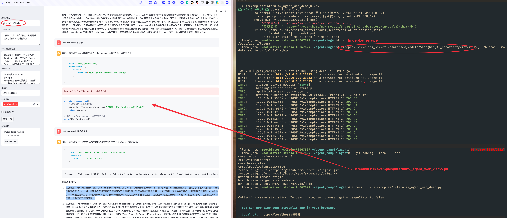

# [**Lagent 自定义你的 Agent 智能体** ](https://github.com/InternLM/Tutorial/blob/camp3/docs/L2/Lagent/task.md#lagent-%E8%87%AA%E5%AE%9A%E4%B9%89%E4%BD%A0%E7%9A%84-agent-%E6%99%BA%E8%83%BD%E4%BD%93)

> [任务](https://github.com/InternLM/Tutorial/blob/camp3/docs/L2/Lagent/task.md)、[文档](https://github.com/InternLM/Tutorial/blob/camp3/docs/L2/Lagent/readme.md)、[视频](https://www.bilibili.com/video/BV18M4m1y7sm/)

## 基础任务（完成此任务即完成闯关）


- 使用 Lagent 自定义一个智能体，并使用 Lagent Web Demo 成功部署与调用，记录复现过程并截图。


- 直接用lagent 


```bash
lmdeploy serve api_server /share/new_models/Shanghai_AI_Laboratory/internlm2_5-7b-chat --model-name internlm2_5-7b-chat

# lagent 前端 
streamlit run examples/internlm2_agent_web_demo.py

```

 


## 资料 学习
##### [Agent 工具能力微调](https://github.com/InternLM/Tutorial/blob/camp2/agent/finetune.md) 可以在自己的代码中根据模型的输出来实现调用函数的逻辑  
> 还没出来   2024-08-20 10:28


###  lagent

- Lagent 中关于工具部分的介绍文档位于 [https://lagent.readthedocs.io/zh-cn/latest/tutorials/action.html](https://lagent.readthedocs.io/zh-cn/latest/tutorials/action.html) 。


> **第三期没有单独提 agentlego ,是准备合并到 agent 里面? 


###  [agentlego 文档](https://agentlego.readthedocs.io/zh-cn/latest/get_started.html)

- [将 agentlego 工具集成到 LangChain 中：](https://agentlego.readthedocs.io/zh-cn/latest/get_started.html#id4) #langchain 
- [将 agentlego 工具集成到 Transformers agent 中：](https://agentlego.readthedocs.io/zh-cn/latest/get_started.html#transformers-agent)  #transformers_agent  #llm调用function 
