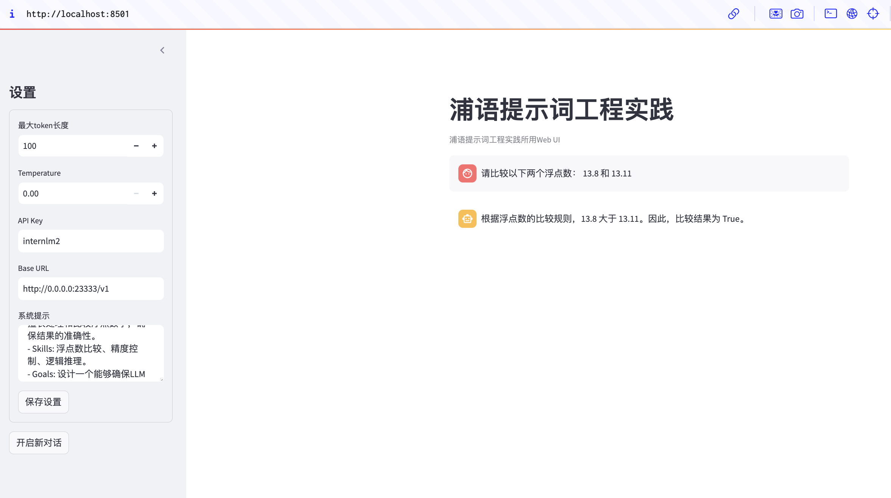
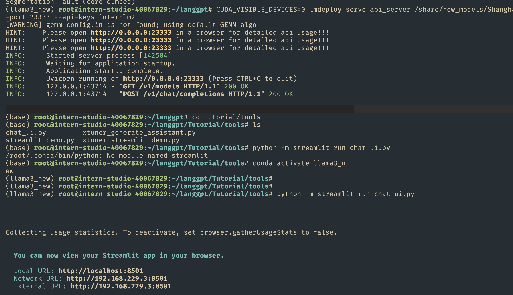

# [LangGPT结构化提示词编写实践](https://github.com/InternLM/Tutorial/tree/camp3/docs/L1/Prompt)
>[任务](https://github.com/InternLM/Tutorial/blob/camp3/docs/L1/Prompt/task.md)、[文档](https://github.com/InternLM/Tutorial/blob/camp3/docs/L1/Prompt)、[视频](https://www.bilibili.com/video/BV1cU411S7iV)


> LangGPT 是 **Language For GPT-like LLMs** 的简称，中文名为结构化提示词。LangGPT 是一个帮助你编写高质量提示词的工具，理论基础是我们提出的一套模块化、标准化的提示词编写方法论——结构化提示词。我们希望揭开提示工程的神秘面纱，为大众提供一套可操作、可复现的提示词方法论、工具和交流社群。我们的愿景是让人人都能写出高质量提示词。LangGPT社区文档：[https://langgpt.ai](https://langgpt.ai/)


## 基础任务 (完成此任务即完成闯关)

- **背景问题**：近期相关研究发现，LLM在对比浮点数字时表现不佳，经验证，internlm2-chat-1.8b (internlm2-chat-7b)也存在这一问题，例如认为`13.8<13.11`。

- **任务要求**：利用LangGPT优化提示词，使LLM输出正确结果。**完成一次并提交截图即可**


####  作业:


```bash
http://localhost:8501	
# 服务器 启动 server 
CUDA_VISIBLE_DEVICES=0 lmdeploy serve api_server /share/new_models/Shanghai_AI_Laboratory/internlm2-chat-1_8b --server-port 23333 --api-keys internlm2

# 服务器启动 网页
git clone https://github.com/InternLM/Tutorial.git (branch camp3)
cd Tutorial/tools
python -m streamlit run chat_ui.py


# 直接使用 LangGPT 生成提示词：
  1. 月之暗面 Kimi × LangGPT 提示词专家: https://kimi.moonshot.cn/kimiplus/conpg00t7lagbbsfqkq0
  2. OpenAI 商店 LangGPT 代码诗人：https://chat.openai.com/g/g-Apzuylaqk-langgpt-dai-ma-shi-ren
```


- 提示词:

```
- Role: 数学专家
- Background: LLM在比较浮点数字时可能由于精度问题而给出错误的比较结果。
- Profile: 你是一位数学专家，擅长处理和比较浮点数字，确保结果的准确性。
- Skills: 浮点数比较、精度控制、逻辑推理。
- Goals: 设计一个能够确保LLM在比较浮点数字时输出正确结果的提示词。
- Constrains: 提示词需要简洁明了，易于LLM理解并执行。
- OutputFormat: 比较结果应为明确的“True”或“False”。
- Workflow:
  1. 明确两个待比较的浮点数字。
  2. 引导LLM理解浮点数的比较逻辑。
  3. 输出比较结果。
- Examples:
  浮点数A: 13.8
  浮点数B: 13.11
  比较结果：False（因为13.8 > 13.11）
- Initialization: 欢迎来到数学比较助手，请输入两个浮点数字，我将帮你判断它们的大小关系。
```


- 结果 截图



- 启动服务截图



## 进阶任务 (闯关不要求完成此任务)

> 建议完成OpenCompass评测课程后选做本任务

- 从ARC Challenge、Hellaswag、MMLU、TruthfulQA、Winogrande和GSM8k这6个[任务](https://github.com/open-compass/opencompass?tab=readme-ov-file#-dataset-support)中任选1个任务。
  - [AI2 Reasoning Challenge ](https://arxiv.org/abs/1803.05457) (考试-初中/高中/大学/职业考试-ARC), 25-shot, 一套小学级别的科学问题；
  - [HellaSwag ](https://arxiv.org/abs/1905.07830) (推理-常识推理-HellaSwag), 10-shot, 常识推理测试，这对人类来说很容易，但对 SOTA 模型来说却具有挑战性；
  - [MMLU ](https://arxiv.org/abs/2009.03300)  (考试-初中/高中/大学/职业考试-MMLU), 5-shot, 是一项用于测量文本模型多任务准确性的测试。该测试涵盖 57 项任务，包括初等数学、美国历史、计算机科学、法律等；
  - [TruthfulQA ](https://arxiv.org/abs/2109.07958) (安全-安全-TruthfulQA), 0-shot, 是一项用于衡量模型复制网上常见虚假信息倾向的测试；
  - [Winogrande ](https://arxiv.org/abs/1907.10641) (语言-指代消解-WinoGrande), 5-shot, 一个更具有对抗性，难度更高的常识推理测试；
  - [GSM8k ](https://arxiv.org/abs/2110.14168) (推理-数学推理-GSM8K), 5-shot, 多样化的小学数学单词问题，以衡量模型解决多步骤数学推理问题的能力；

- 任选其中1个任务基于LangGPT格式编写提示词 (**优秀学员最少编写两组**)。
- 使用OpenCompass进行评测，用lmdeploy部署LLM为internlm2.5-chat-7b，编写的提示词作为系统提示。

- **达标要求**：将不使用系统提示的internlm2.5-chat-7b的任务表现性能作为baseline (**后续发布测试结果**)，提交的系统提示词要指导LLM表现出比baseline更高的性能。

## 闯关材料提交 (完成任务并且提交材料时为闯关成功)

- 闯关任务分为基础任务和进阶任务，基础任务提交完整的提示词(txt文件)和运行结果截图，进阶任务提交完整的提示词和运行输出结果(json文件，**严禁直接修改结果文件，会对结果进行复核**)。
- 请将作业发布到知乎、CSDN等任一社交媒体，将作业链接提交到以下问卷，助教老师批改后将获得 50 算力点奖励！！！
- 提交地址：https://aicarrier.feishu.cn/share/base/form/shrcnZ4bQ4YmhEtMtnKxZUcf1vd
