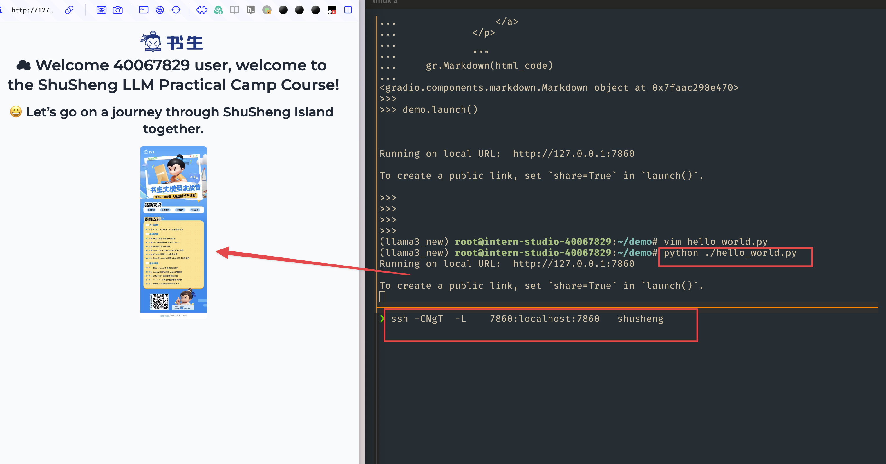

###  关卡任务

- 完成SSH连接与端口映射并运行hello_world.py	



- 将Linux基础命令在开发机上完成一遍	


- 使用 VSCODE 远程连接开发机并创建一个conda环境	


- 创建并运行test.sh文件	


## 笔记


https://aicarrier.feishu.cn/wiki/XZChwwDsciyFyHk5mGTc1EKinkc

### linux 命令

####  find

1. **按文件大小查找**：使用`-size`选项按照文件大小查找文件。例如，`find /path/to/directory -size +100M`将查找指定目录及其子目录中大于100MB的文件。
2. **按修改时间查找**：使用`-mtime`、`-atime`或`-ctime`选项按照文件的修改时间、访问时间或状态更改时间查找文件。例如，`find /path/to/directory -mtime -7`将查找指定目录及其子目录中在7天内修改过的文件。
3. **按文件权限查找**：使用`-perm`选项按照文件权限查找文件。例如，`find /path/to/directory -perm 755`将查找指定目录及其子目录中权限为755的文件。
4. **按用户或组查找**：使用`-user`或`-group`选项按照文件的所有者或所属组查找文件。例如，`find /path/to/directory -user username`将查找指定目录及其子目录中属于用户`username`的文件。


- `nice`：更改进程的优先级。`nice` 值越低，进程优先级越高。

  - ```Bash
    nice -n 10 long-running-command  # 以较低优先级运行一个长时间运行的命令
    ```

- `pstree`：以树状图的形式显示当前运行的进程及其父子关系。

  - ```Bash
    pstree  # 显示进程树
    ```

- `pgrep`：查找匹配条件的进程。可以根据进程名、用户等条件查找进程。

  - ```Bash
    pgrep -u username  # 查找特定用户的所有进程
    ```


#### 以下是 `nvidia-smi` 命令的一些基本命令用法：

- 显示 GPU 状态的摘要信息：

  - ```Bash
    nvidia-smi
    ```

- 显示详细的 GPU 状态信息：

  - ```Bash
    nvidia-smi -l 1
    ```

  -  这个命令会每1秒更新一次状态信息。

- 显示 GPU 的帮助信息：

  - ```Bash
    nvidia-smi -h
    ```

- 列出所有 GPU 并显示它们的 PID 和进程名称：

  - ```Bash
    nvidia-smi pmon
    ```

- 强制结束指定的 GPU 进程：

  - ```Bash
    nvidia-smi --id=0 --ex_pid=12345
    ```

  -  这会强制结束 GPU ID 为 0 上的 PID 为 12345 的进程。

- 设置 GPU 性能模式：

  - ```Bash
    nvidia-smi -pm 1
    nvidia-smi -i 0 -pm 1
    ```

  -  第一个命令会为所有 GPU 设置为性能模式，第二个命令只针对 ID 为 0 的 GPU。

- 重启 GPU：

  - ```Bash
    nvidia-smi --id=0 -r
    ```

  -  这会重启 ID 为 0 的 GPU。

- 显示帮助信息：

  - ```Bash
    nvidia-smi -h
    ```


###  conda 命令行

##### 删除与导出虚拟环境

```bash

#获得环境中的所有配置
conda env export --name myenv > myenv.yml
#重新还原环境
conda env create -f  myenv.yml
```


### studio-conda使用与Shell

#### studio-smi是用来查看查看虚拟内存占用的

  `nvidia-smi` 是用于监控和管理物理 NVIDIA GPU 设备的工具，而 `vgpu-smi` 专门用于监控和管理通过 NVIDIA vGPU 技术虚拟化的 GPU 资源。

```Bash
#!/bin/bash

if command -v vgpu-smi &> /dev/null
then
    echo "Running studio-smi by vgpu-smi"
    vgpu-smi
else
    echo "Running studio-smi by nvidia-smi"
    nvidia-smi
fi
```

我们查看`/share/install_conda_env.sh`文件内容如下：

```Bash
#!/bin/bash
# clone internlm-base conda env to user's conda env
# created by xj on 01.07.2024
# modifed by xj on 01.19.2024 to fix bug of conda env clone
# modified by ljy on 01.26.2024 to extend

XTUNER_UPDATE_DATE=`cat /share/repos/UPDATE | grep xtuner |awk -F= '{print $2}'`
HOME_DIR=/root
CONDA_HOME=$HOME_DIR/.conda
SHARE_CONDA_HOME=/share/conda_envs
SHARE_HOME=/share

list() {
    cat <<-EOF
  预设环境          描述

  internlm-base    pytorch:2.0.1, pytorch-cuda:11.7
  xtuner           Xtuner(源码安装: main $(echo -e "\033[4mhttps://github.com/InternLM/xtuner/tree/main\033[0m"), 更新日期：$XTUNER_UPDATE_DATE)
  pytorch-2.1.2    pytorch:2.1.2, pytorch-cuda:11.8
EOF
}

help() {
    cat <<-EOF
  说明: 用于快速clone预设的conda环境

  使用: 
  
    1. studio-conda env -l/list 打印预设的conda环境列表
  
    2. studio-conda <target-conda-name> 快速clone: 默认拷贝internlm-base conda环境
    
    3. studio-conda -t <target-conda-name> -o <origin-conda-name> 将预设的conda环境拷贝到指定的conda环境
        
EOF
}

clone() {
    source=$1
    target=$2

    if [[ -z "$source" || -z "$target" ]]; then
        echo -e "\033[31m 输入不符合规范 \033[0m"
        help
        exit 1
    fi

    if [ ! -d "${SHARE_CONDA_HOME}/$source" ]; then
        echo -e "\033[34m 指定的预设环境: $source不存在\033[0m"
        list
        exit 1
    fi

    if [ -d "${CONDA_HOME}/envs/$target" ]; then
        echo -e "\033[34m 指定conda环境的目录: ${CONDA_HOME}/envs/$target已存在, 将清空原目录安装 \033[0m"
        wait_echo&
        wait_pid=$!
        rm -rf "${CONDA_HOME}/envs/$target"
        kill $wait_pid
    fi

    echo -e "\033[34m [1/2] 开始安装conda环境: <$target>. \033[0m"
    sleep 3
    tar --skip-old-files -xzvf /share/pkgs.tar.gz -C ${CONDA_HOME}
    wait_echo&
    wait_pid=$!
    conda create -n $target --clone ${SHARE_CONDA_HOME}/${source}
    if [ $? -ne 0 ]; then
        echo -e "\033[31m 初始化conda环境: ${target}失败 \033[0m"
        exit 10
    fi

    kill $wait_pid

    # for xtuner, re-install dependencies
    case "$source" in
    xtuner)
        source_install_xtuner $target
        ;;
    esac

    echo -e "\033[34m [2/2] 同步当前conda环境至jupyterlab kernel \033[0m"
    lab add $target
    source $CONDA_HOME/bin/activate $target
    cd $HOME_DIR

    echo -e "\033[32m conda环境: $target安装成功! \033[0m"

    echo """
    ============================================
                    ALL DONE!
    ============================================
    """
}

······
dispatch $@
```

其中的*`list`*`()`等，都是`studio-conda`的函数，可以实现某些操作，比如我们可以使用`studio-conda env list`来查看预设的环境：


其中*`clone`*`()`函数的主要作用就是用来复制环境的，不过只能从预设的环境中进行复制，主要的代码其实就是：

```Bash
tar --skip-old-files -xzvf /share/pkgs.tar.gz -C ${CONDA_HOME}

conda create -n $target --clone ${SHARE_CONDA_HOME}/${source}
```

解压预设环境的压缩包，然后通过clone创建虚拟环境，不过在Shell脚本中还设置了一些逻辑，不过都是一些判断，如果你熟悉任何一种编程语言应该都可以看懂，如果看不懂问题也不大。


#### conda环境导出到其他机器

那么我们如何将我们自己创建的环境添加到`studio-conda`中呢？

第一步，将新的conda环境创建到/share/conda_envs下

> conda create -p /share/conda_envs/xxx python=3.1x

第二步，将本机/root/.conda/pkgs下的文件拷贝到/share/pkgs中，重新压缩并替换(此步骤是为了把conda创建过程中大的公共包存储起来，避免重复下载)

> cp -r -n /root/.conda/pkgs/* /share/pkgs/
>
> cd /share && tar -zcvf pkgs.tar.gz pkgs

第三步，更新install_conda_env.sh中的list函数，增加新的conda环境说明。


