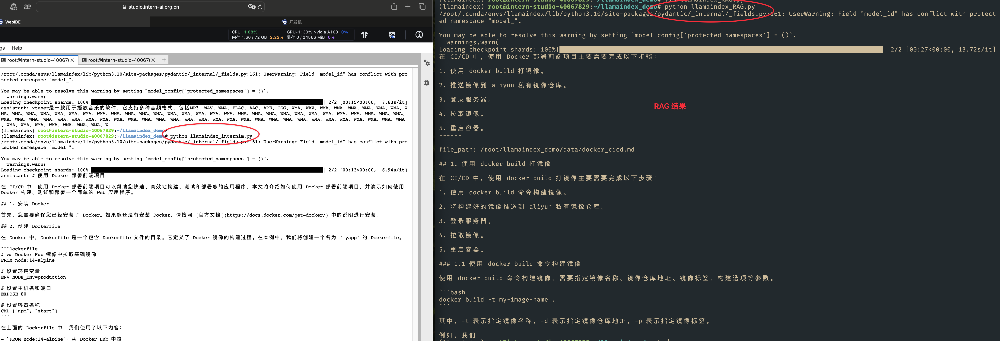

# [Llamaindex RAG实践](https://github.com/InternLM/Tutorial/tree/camp3/docs/L1/LlamaIndex)
> [任务](https://github.com/InternLM/Tutorial/blob/camp3/docs/L1/LlamaIndex/task.md)、[文档](https://github.com/InternLM/Tutorial/blob/camp3/docs/L1/LlamaIndex)、[视频](https://www.bilibili.com/video/BV19E4m1X79q/)

## 基础任务 (完成此任务即完成闯关)


- **任务要求**：基于 LlamaIndex 构建自己的 RAG 知识库，寻找一个问题 A 在使用 LlamaIndex 之前InternLM2-Chat-1.8B模型不会回答，借助 LlamaIndex 后 InternLM2-Chat-1.8B 模型具备回答 A 的能力，截图保存。

问题  **在 CI/CD 中怎么使用 Docker 部署前端项目** ? ( 在data 目录上传了关于cic docker 的文件)




## 闯关材料提交 (完成任务并且提交材料时为闯关成功)

- 请将作业发布到知乎、CSDN等任一社交媒体，将作业链接提交到以下问卷，助教老师批改后将获得 100 算力点奖励！！！
- 提交地址：https://aicarrier.feishu.cn/share/base/form/shrcnZ4bQ4YmhEtMtnKxZUcf1vd


### 资料学习

- nltk  我们在使用开源词向量模型构建开源词向量的时候，需要用到第三方库 `nltk` 的一些资源

-  rag code 

```python

from llama_index.core import VectorStoreIndex, SimpleDirectoryReader, Settings

from llama_index.embeddings.huggingface import HuggingFaceEmbedding
from llama_index.llms.huggingface import HuggingFaceLLM

#初始化一个HuggingFaceEmbedding对象，用于将文本转换为向量表示
embed_model = HuggingFaceEmbedding(
#指定了一个预训练的sentence-transformer模型的路径
    model_name="/root/model/sentence-transformer"
)
#将创建的嵌入模型赋值给全局设置的embed_model属性，
#这样在后续的索引构建过程中就会使用这个模型。
Settings.embed_model = embed_model

llm = HuggingFaceLLM(
    model_name="/root/model/internlm2-chat-1_8b",
    tokenizer_name="/root/model/internlm2-chat-1_8b",
    model_kwargs={"trust_remote_code":True},
    tokenizer_kwargs={"trust_remote_code":True}
)
#设置全局的llm属性，这样在索引查询时会使用这个模型。
Settings.llm = llm

#从指定目录读取所有文档，并加载数据到内存中
documents = SimpleDirectoryReader("/root/llamaindex_demo/data").load_data()
#创建一个VectorStoreIndex，并使用之前加载的文档来构建索引。
# 此索引将文档转换为向量，并存储这些向量以便于快速检索。
index = VectorStoreIndex.from_documents(documents)
# 创建一个查询引擎，这个引擎可以接收查询并返回相关文档的响应。
query_engine = index.as_query_engine()
response = query_engine.query("xtuner是什么?")

print(response)
```

