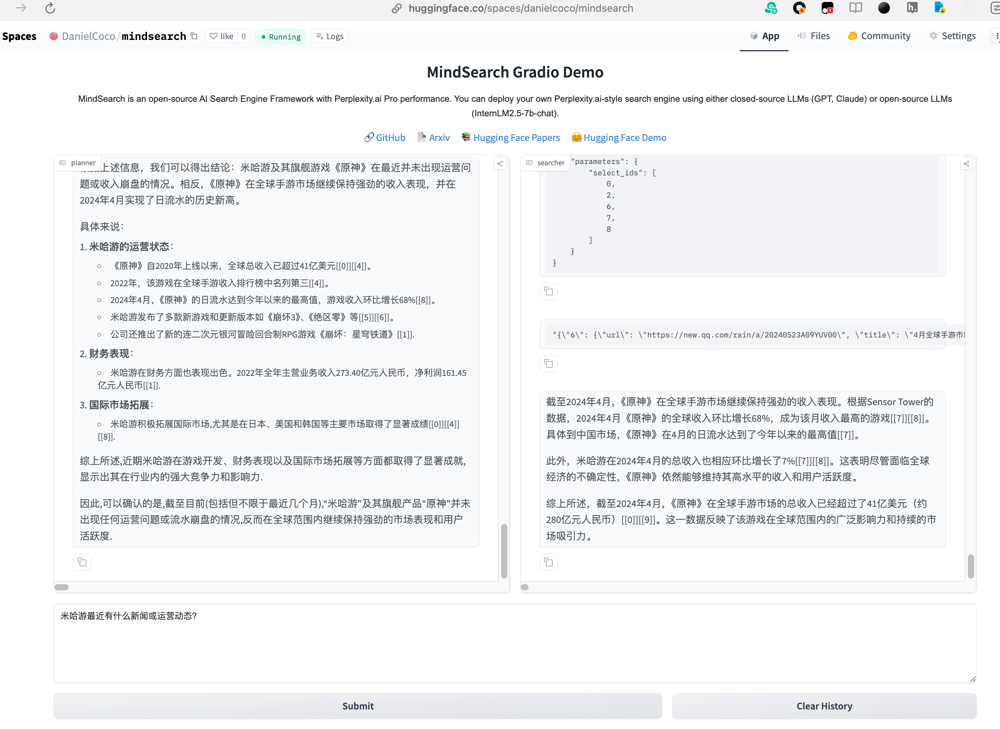

## 基础任务（完成此任务即完成闯关）

- 按照教程，将 MindSearch 部署到 HuggingFace 并美化 Gradio 的界面，并提供截图和 Hugging Face 的Space的链接。

#### Hugging Face 的Space的链接 :https://huggingface.co/spaces/DanielCoco/mindsearch

#### 截图

## 资料

[任务](https://github.com/InternLM/Tutorial/blob/camp3/docs/L2/MindSearch/task.md)、[文档](https://github.com/InternLM/Tutorial/blob/camp3/docs/L2/MindSearch/readme_github.md)
