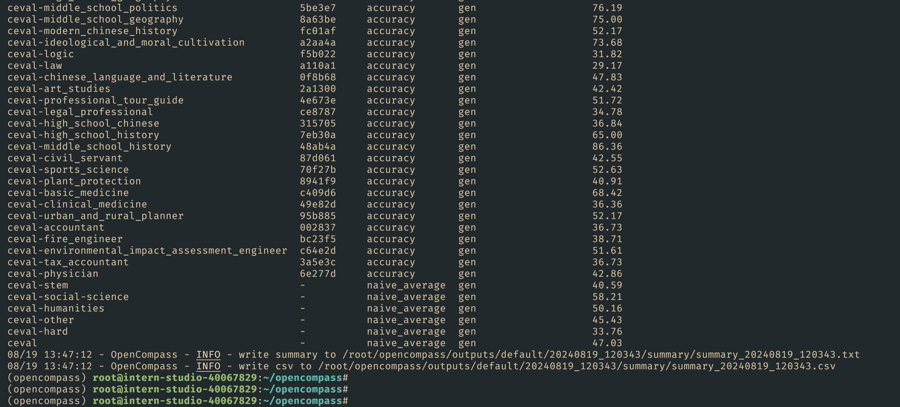

# OpenCompass 评测 InternLM-1.8B 实践


|                                                                                                                                                                                                                          |
| ------------------------------------------------------------------------------------------------------------------------------------------------------------------------------------------------------------------------ |
| [任务](https://github.com/InternLM/Tutorial/blob/camp3/docs/L1/OpenCompass/task.md)、[文档](https://github.com/InternLM/Tutorial/blob/camp3/docs/L1/OpenCompass/readme.md)、[视频](https://www.bilibili.com/video/BV1RM4m1279j/) |

## 基础任务（完成此任务即完成闯关）

- 使用 OpenCompass 评测 internlm2-chat-1.8b 模型在 ceval 数据集上的性能，记录复现过程并截图。

<details>
           <summary style="font-size:20">详细步骤 </summary>
- 1.安装opencompass

```bash
cd /root
git clone -b 0.2.4 https://github.com/open-compass/opencompass
cd opencompass
pip install -e .

apt-get update
apt-get install cmake
pip install -r requirements.txt
pip install protobuf

```
 - 2.数据准备

```bash
cp /share/temp/datasets/OpenCompassData-core-20231110.zip /root/opencompass/
unzip OpenCompassData-core-20231110.zip
```

列出所有跟 InternLM 及 C-Eval 相关的配置

```bash
python tools/list_configs.py internlm ceval

```
3.使用命令行配置参数法进行评测

打开 opencompas s文件夹 下configs/models/hf_internlm/ 的`hf_internlm2_chat_1_8b.py`,贴入以下代码

```bash
from opencompass.models import HuggingFaceCausalLM

models = [
    dict(
        type=HuggingFaceCausalLM,
        abbr='internlm2-1.8b-hf',
        path="/share/new_models/Shanghai_AI_Laboratory/internlm2-chat-1_8b",
        tokenizer_path='/share/new_models/Shanghai_AI_Laboratory/internlm2-chat-1_8b',
        model_kwargs=dict(
            trust_remote_code=True,
            device_map='auto',
        ),
        tokenizer_kwargs=dict(
            padding_side='left',
            truncation_side='left',
            use_fast=False,
            trust_remote_code=True,
        ),
        max_out_len=100,
        min_out_len=1,
        max_seq_len=2048,
        batch_size=8,
        run_cfg=dict(num_gpus=1, num_procs=1),
    )
]
```

配置环境变量

```bash
#环境变量配置
export MKL_SERVICE_FORCE_INTEL=1
#或
export MKL_THREADING_LAYER=GNU
```

通过以下命令评测 InternLM2-Chat-1.8B 模型在 C-Eval 数据集上的性能。由于 OpenCompass 默认并行启动评估过程，在第一次运行时以 --debug 模式启动评估，并检查是否存在问题。在 --debug 模式下，任务将按顺序执行，并实时打印输出。

```bash
python run.py --datasets ceval_gen --models hf_internlm2_chat_1_8b --debug
```

</details>

#### 截图



## 进阶任务（闯关不要求完成此任务）

- 使用 OpenCompass 进行主观评测（选做）
- 使用 OpenCompass 评测 I nte r nLM2-Chat-1.8B 模型使用 LMDeploy部署后在 ceval 数据集上的性能（选做）

