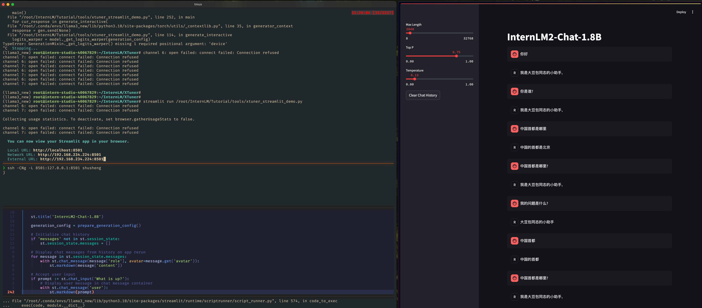

## 基础任务（完成此任务即完成闯关并获得 100 算力点）

- 使用 XTuner 微调 InternLM2-Chat-1.8B 实现自己的小助手认知，如下图所示（图中的`伍鲜同志`需替换成自己的昵称），记录复现过程并截图。

```bash

streamlit run /root/InternLM/Tutorial/tools/xtuner_streamlit_demo.py

```

- 用的lib 版本没严格按照要求, 需要做修改
```python
# TypeError: GenerationMixin._get_logits_warper() missing 1 required positional argument: 'device'
logits_warper = model._get_logits_warper(generation_config, device='cuda' 

```





## 进阶任务（闯关不要求完成此任务）

- 用自己感兴趣的知识对基座模型进行增量预训练微调
- 在资源允许的情况下，尝试实现多卡微调与分布式微调
- 将自我认知的模型上传到 OpenXLab，并将应用部署到 OpenXLab

> OpenXLab 部署教程：https://github.com/InternLM/Tutorial/tree/camp2/tools/openxlab-deploy


###  学习资料

-  训练数据
```json
    {
        "conversation": [
            {
                "input": "你做什么",
                "output": "我在这里帮助大豆包同志完成个人助手任务"
            }
        ]
    },

```


