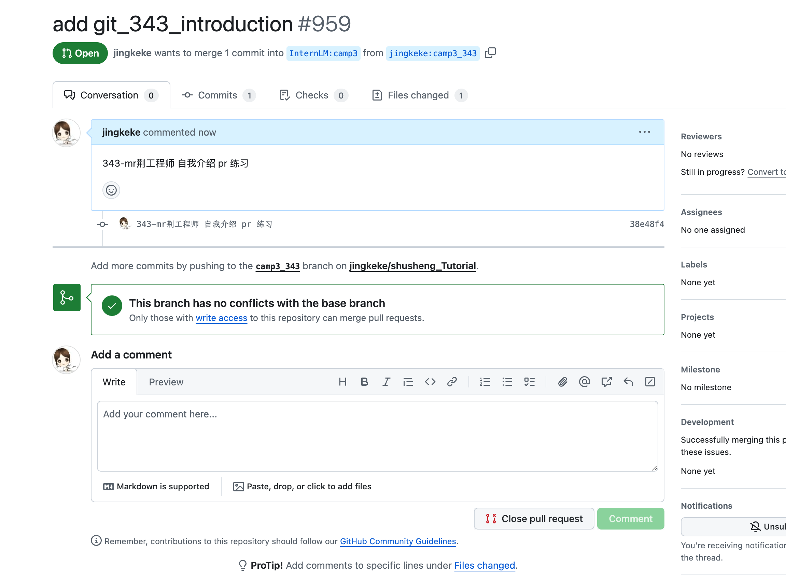

>[任务](https://github.com/InternLM/Tutorial/blob/camp3/docs/L0/Git/task.md)、[文档](https://github.com/InternLM/Tutorial/blob/camp3/docs/L0/Git)、[视频](https://www.bilibili.com/video/BV1Pz421i7bw/)

### 关卡任务


- **任务1**: 破冰活动：自我介绍 

  > 每位参与者提交一份自我介绍。 提交地址：https://github.com/InternLM/Tutorial 的 camp3 分支～





- **任务2**: 实践项目：构建个人项目

> 创建一个个人仓库，用于提交笔记、心得体会或分享项目。

GitHub 仓库链接   https://github.com/jingkeke/internLM2/tree/main


## 学习 
https://github.com/InternLM/Tutorial/blob/camp3/docs/L0/Git/readme.md


### 常用 Git 操作

- git reflog
查看命令历史：查看仓库的操作历史

- `git cherry-pick	`   选择一个提交，将其作为新的提交引入


###  全局设置 vs. 本地设置


- **本地设置**：这些设置仅适用于特定的 Git 仓库。这对于你需要在不同项目中使用不同身份时很有用，例如区分个人和工作项目。


**本地设置用户信息** 首先，确保你当前处于你想要配置的 Git 仓库的目录中。然后，输入以下命令来仅为该仓库设置用户名和电子邮件地址：

```
git config --local user.name "Your Name"
git config --local user.email "your.email@example.com"
```


- **查看仓库配置**：

  ```
  git config --local --list
  ```


### 常用插件

Git History: Git 日志查看器。


