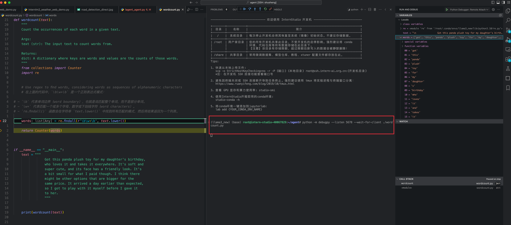

## 任务


####  请用Python实现一个wordcount函数，统计英文字符串中每个单词出现的次数。返回一个字典，key为单词，value为对应单词出现的次数。

```python
def wordcount(text):
    """
    Count the occurrences of each word in a given text.

    Args:
    text (str): The input text to count words from.

    Returns:
    dict: A dictionary where keys are words and values are the counts of those words.
    """
    from collections import Counter
    import re


    # Use regex to find words, considering words as sequences of alphanumeric characters
    # 在上面的代码中，`\b\w+\b` 是一个正则表达式模式：

# - `\b` 代表单词边界（word boundary），也就是说匹配整个单词，而不是部分单词。
# - `\w+` 代表匹配一个或多个字母、数字或下划线字符（word characters）。
# - `re.findall()` 函数会在字符串 `text.lower()` 中找到所有匹配的模式，然后将结果返回为一个列表。

    words = re.findall(r'\b\w+\b', text.lower())

    return Counter(words)


if __name__ == "__main__":
    text = """
                Got this panda plush toy for my daughter's birthday, 
                who loves it and takes it everywhere. It's soft and 
                super cute, and its face has a friendly look. It's 
                a bit small for what I paid though. I think there 
                might be other options that are bigger for the 
                same price. It arrived a day earlier than expected, 
                so I got to play with it myself before I gave it 
                to her.
                """


    print(wordcount(text))

```

- 截图 




###  学习 

https://aicarrier.feishu.cn/wiki/VRgCwVAVziIMI9kvvolcA8xUndg