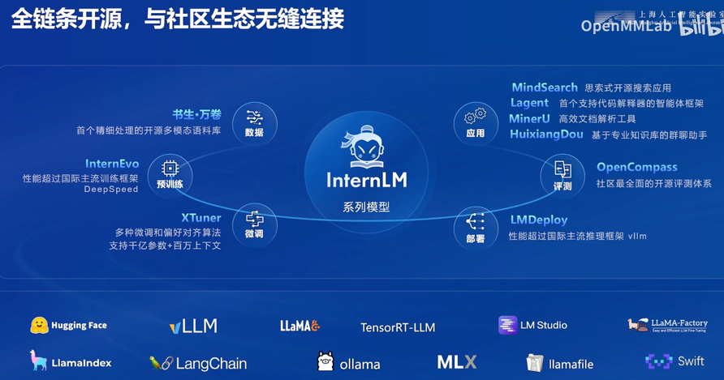
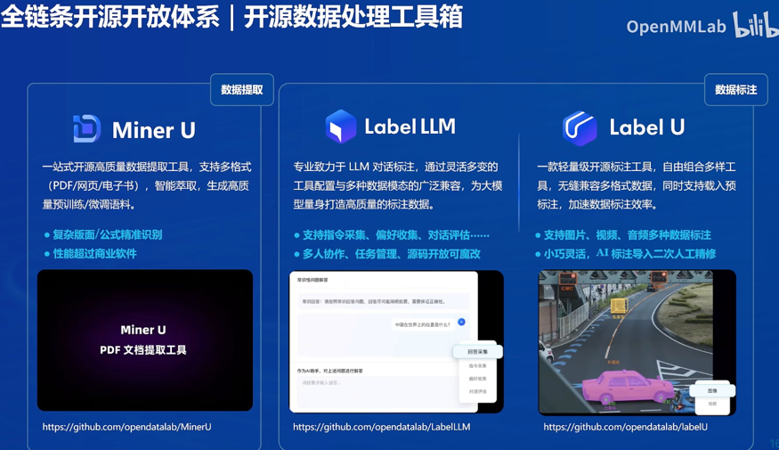
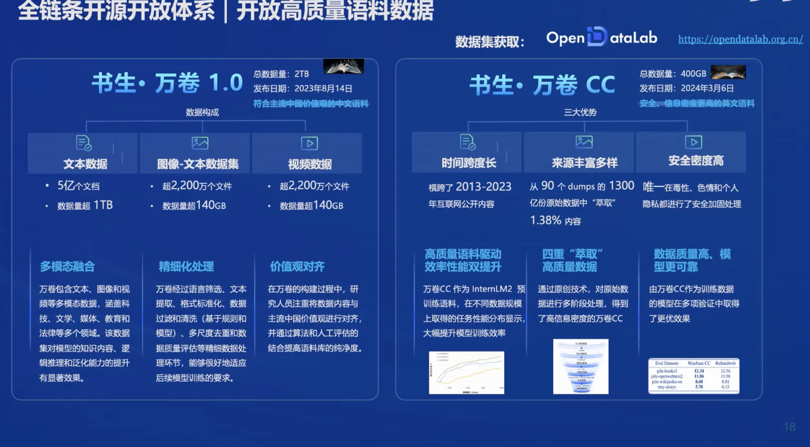
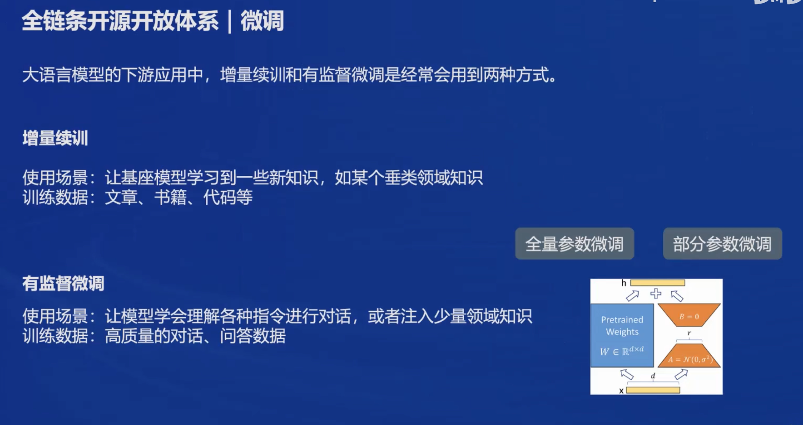
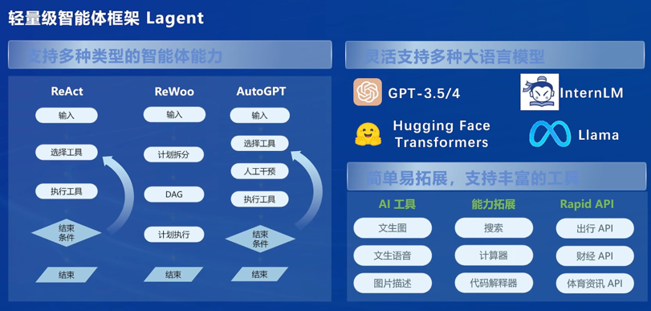
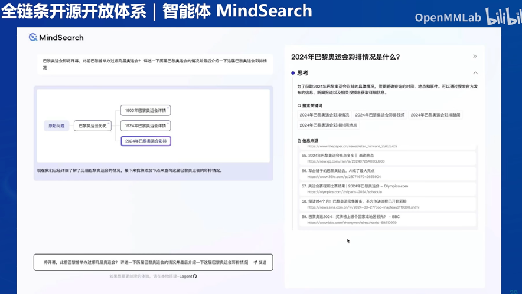

# 书生浦语大模型介绍

- [OpenCompass](https://gitee.com/open-compass/opencompass)：面向大模型评测的一站式平台
- [IMDeploy](https://gitee.com/InternLM/lmdeploy)：涵盖了 LLM 任务的全套轻量化、部署和服务解决方案的高效推理工具箱
- [XTuner](https://gitee.com/InternLM/xtuner)：轻量级微调大语言模型的工具库
- [InternLM-XComposer](https://gitee.com/InternLM/InternLM-XComposer)：浦语·灵笔，基于书生·浦语大语言模型研发的视觉-语言大模型
- [Lagent](https://gitee.com/InternLM/lagent)：一个轻量级、开源的基于大语言模型的智能体（agent）框架
- [InternLM](https://gitee.com/InternLM/InternLM)：一个开源的轻量级训练框架，旨在支持大模型训练而无需大量的依赖

## 书生浦语大模型的开源历程

- 书生浦语大模型自2023年6月份首次发布
- 开源 InternLM2-Math-Plus，刷新 开源数学模型性能上限
- 2024.7.4 InternLM2.5

## 书生浦语2.5的主要亮点

- 书生浦语2.5具备超长上下文能力， 支持100万字上下文

- 基于规划和搜索解决复杂问题 (mindsearch)

### 书生•浦语开源模型谱系
- 1.8B 超轻量级，可用于端侧应用或 者开发者快速学习上手
- 7B 模型轻便但性能不俗，为轻量 级的研究和应用提供强力支撑
- 20B 模型的综合性能更为强劲，可以 有效支持更加复杂的实用场景
- 102B 性能强大的闭源模型，典型 场景表现接近GPT-4
- InternLM-XComposer （灵笔）
- InternLM-Math （数学）
- InternLM-WOX （文曲星）

### 全链条开源，与社区生态无缝连接

- MindSearch 思索式开源搜索应用
- Lagent 首个支持代码解释器的智能体框架
- MinerU 高效文档解析工具
- HuixiangDou 基于专业知识库的群聊助手

####  开源数据处理工具箱

- Label LIM
> 专业致力于LLM 对话标注，通过灵活多变的 工具配置与多种数据模态的广泛兼容，为大模型量身打造高质量的标注数据。
> 

#### 数据语料

 #### 模型选型

- 根据业务需求选择合适的书生大模型，考虑模型规模、性能和成本。
- 轻量级模型适合资源受限场景，重量级模型适合复杂任务处理。
	- 对于资源受限的场景，可以选择7B模型；
	- 而对于需要处理更复杂任务的场景，则可能需要选择20B模型。
	- 书生大模型支持多种语言和多模态能力，这在选择模型时也需要考虑。

#### 业务场景微调
- 使用XTuner微调框架对选定的模型进行有监督或无监督微调。
- 微调使模型适应特定行业知识或业务流程。

##### ZeRO优化器

- **Zero Redundancy Optimizer (ZeRO)**：采用多种策略降低内存占用，包括分片和复制参数。

- https://www.microsoft.com/en-us/research/blog/zero-deepspeed-new-system-optimizations-enable-training-models-with-over-100-billion-parameters/

  

#### 智能体构建
- 利用lagend和agentLego框架构建多功能智能体。
- 智能体能够理解指令、进行对话和执行任务。

- mindsearch 思维导图方式 
 

#### 模型评测
- 通过OpenCompass评测体系对模型进行多维度评测。 

  - CompassHub：高质量评测基准社区
- 评测确保模型在语言理解、推理和交互体验等方面的表现。

  

#### 部署上线
- 使用LMDeploy工具链进行模型部署，优化推理速度和资源使用。
	- LMDeploy支持多种访问接口，如Python接口、RESTful接口和gRPC接口，使得模型可以轻松集成到现有的系统中
- 部署后持续监控模型性能，确保服务的稳定性和可靠性。

##### 长上下文处理：

- 为了处理长文本，InternLM2在预训练的第二阶段使用了长达32,000个token的上下文窗口。这通过扩展模型的上下文理解能力，使得模型能够处理更复杂的任务，如长篇文章的理解和生成。
- 实现长上下文处理的关键在于模型的架构设计，InternLM2采用了Grouped-Query Attention（GQA）机制，这使得模型能够在保持高速度的同时处理非常长的序列，同时保持较低的GPU内存使用。
- 在训练过程中，通过逐步增加序列长度，模型能够适应更长的文本，并在长上下文条件下进行有效的学习和推理。

#### 对齐 

LHF 大语言模型对齐方法，它通过结合人类反馈来学习获得符合人类偏好的奖励模型，并使用近端策略优化（PPO）为模型提供奖励信号，使模型能够更好地理解和执行传统方法难以定义的任务。但是，在应用中仍然存在以下问题：

1. 偏好冲突 **Preference Conflict**：Helpful, Harmless, Honest 目标间相互矛盾。
2. 奖励黑客 **Reward Hacking**：模型可能会学会通过捷径欺骗奖励系统以获得高分。

Conditional Online RLHF (Cool RLHF) 对于上述两个问题分别给出了解决方案，对于偏好冲突，Cool RLHF 首先引入了一个条件奖励机制来调和多样化的偏好，使其能够根据特定条件给不同的偏好动态分配 Attention， 从而整合多个偏好。此外，Cool RLHF 采用了多轮在线  RLHF 策略，减轻奖励黑客行为的发生。

##### Online RLHF

在线强化学习来自人类反馈（Online RLHF）是一种训练大型语言模型（LLM）的方法，旨在使模型更好地适应人类用户的反馈，以改善其对话和决策能力。这种方法特别关注于实时地调整模型的行为，以响应最新的人类评价。

## 

## 开源工具体系介绍

上海重点实验室在数据方面有书生万卷开源数据集，预训练方面有InternLM-Train 框架，微调方面有XTuner框架，部署方面开源了LMDeploy工具，评测方面开源了openCompass司南评测体系，智能体应用方面开源了legend和agentlego框架和工具箱。

