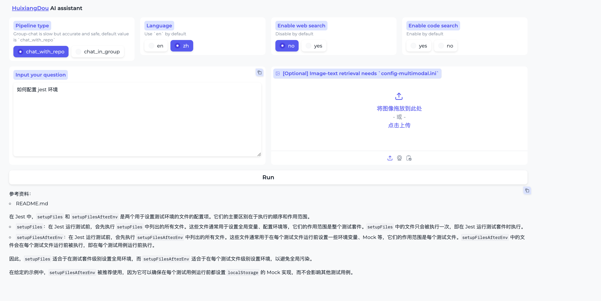
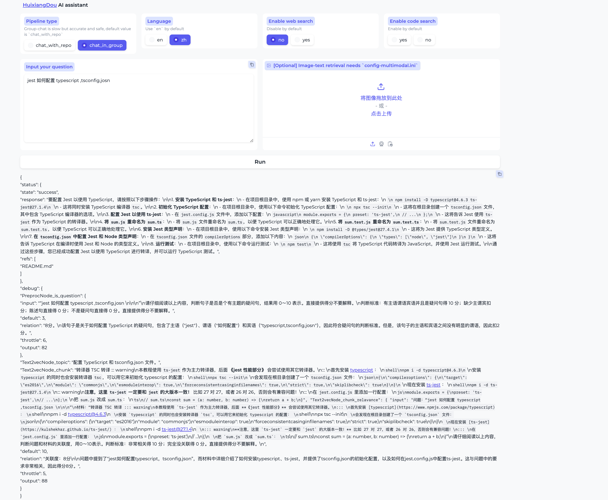

[任务](https://github.com/InternLM/Tutorial/blob/camp3/docs/L2/Huixiangdou/task.md)、[文档](https://github.com/InternLM/Tutorial/blob/camp3/docs/L2/Huixiangdou/readme.md)、[视频](https://www.bilibili.com/video/BV1C5W2epEYP/)

## 基础任务

>  在 InternStudio 中利用 Internlm2-7b 搭建标准版茴香豆知识助手，并使用 Gradio 界面完成 2 轮问答（问题不可与教程重复，作业截图需包括 gradio 界面问题和茴香豆回答）。知识库可根据根据自己工作、学习或感兴趣的内容调整，如金融、医疗、法律、音乐、动漫等（优秀学员必做）。

####  配置过程 

- 用的 cuda 11.7  
	- faiss 下载 
```bash
pip install faiss-gpu-cu11[fix_cuda]
```


- 修改 配置文件
>茴香豆的所有功能开启和模型切换都可以通过 `config.ini` 文件进行修改 /root/huixiangdou/config.ini

```bash
sed -i '9s#.*#embedding_model_path = "/root/models/bce-embedding-base_v1"#' /root/huixiangdou/config.ini
sed -i '15s#.*#reranker_model_path = "/root/models/bce-reranker-base_v1"#' /root/huixiangdou/config.ini
sed -i '43s#.*#local_llm_path = "/root/models/internlm2-chat-7b"#' /root/huixiangdou/config.ini
```

- 启动 web 端查询 (用的茴香豆 2024-09-04   **commit** 1d9fb4cdb8737f7d25007c5d428c602f60e7d9a7 )
> 之前版本的 `python3 -m huixiangdou.gradio` 改成了 huixiangdou.gradio_ui

```bash

cd /root/huixiangdou
python3 -m huixiangdou.gradio_ui

```

- 问题1 



- 测试问题2 
> 格式需要改进....



##  在 Web 版茴香豆中创建自己的问答知识助手，并完成微信群或飞书群的部署，在群内与茴香豆助手完成至少 1 轮问答（作业截图需包括问题和茴香豆回答）。


##  知识

[**茴香豆**](https://github.com/InternLM/HuixiangDou/) 是由书生·浦语团队开发的一款开源、专门针对国内企业级使用场景设计并优化的知识问答工具


####  命令解释 
-  sed 
```bash
sed -i '9s#.*#embedding_model_path = "/root/models/bce-embedding-base_v1"#' /root/huixiangdou/config.ini

```

这个命令使用sed来编辑文件。

- `sed` 是一个文本处理工具，可以用来搜索、添加、删除和替换文本。
- `-i` 选项表示"在原地修改"，意思是 sed 会直接修改原来的文件，而不是创建一个新文件。
- `'9s#.*#embedding_model_path = "/root/models/bce-embedding-base_v1"#' 是 sed 的命令部分：
        + `9` 表示从第 9 行开始匹配。
        + `s` 命令表示 substitution（替换），它将寻找后面指定的 pattern，然后将其替换为replacement字符串。
        + `#.*#` 是 pattern，表示匹配从开头到结尾的任何内容（.* 代表任意字符，# 作为 delimeter）。
        + `embedding_model_path = "/root/models/bce-embedding-base_v1"` 是 replacement 字符串，它将替换掉原来的内容。

因此，这个命令是在文件 `/root/huixiangdou/config.ini` 的第 9 行中，用新的字符串替换掉原来所有的内容，使得该行变成 `embedding_model_path = "/root/models/bce-embedding-base_v1"`。

####  监控 
```bash
pip install gpustat
watch --color -n1 gpustat -cpu
```


### 多模态功能
- [ ] 开启 茴香豆多模态功能需要支持图文的多模态向量和重排模型，本教程使用的是智源旗下的 [BGE](https://huggingface.co/BAAI) 开源模型家族。

这次我们使用 `huggingface-cli download` 的方法从 Huggingface Hub 上拉取模型到本地：

```shell
# 设置环境变量
export HF_ENDPOINT='https://hf-mirror.com' # 使用 huggingface 中国镜像加速下载，如果在国外，忽略此步骤

# 下载模型
## 模型文件较大，如果遇到下载报错，重新运行命令就好
huggingface-cli download BAAI/bge-m3 --local-dir /root/models/bge-m3
huggingface-cli download BAAI/bge-visualized --local-dir /root/models/bge-visualized
huggingface-cli download BAAI/bge-reranker-v2-minicpm-layerwise --local-dir /root/models/bge-reranker-v2-minicpm-layerwise

# 需要手动将视觉模型移动到 BGE-m3 文件夹下
mv /root/models/bge-visualized/Visualized_m3.pth /root/models/bge-m3/
```


