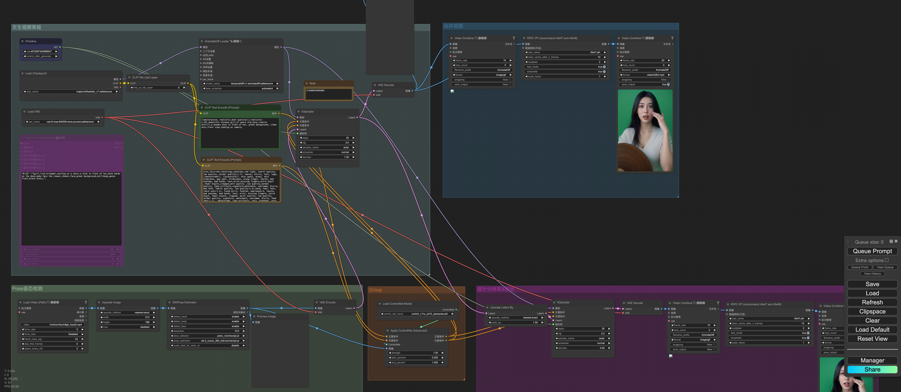
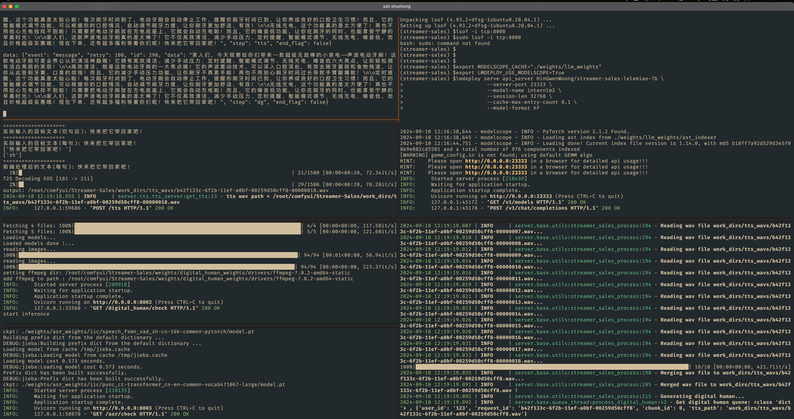
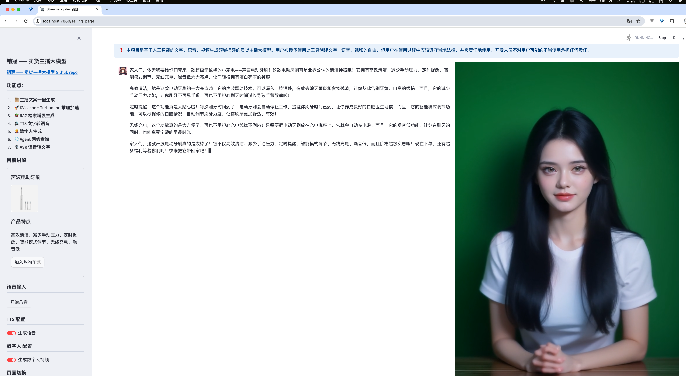

[文档](https://github.com/InternLM/Tutorial/blob/camp3/docs/EasterEgg/StreamerSales)、[视频](https://www.bilibili.com/video/BV1f1421b7Du)
%% 本地 环境 /Volumes/T9/m3max/LLM  %%

### 环境搭建

```bash
git clone https://github.com/PeterH0323/Streamer-Sales.git  
cd Streamer-Sales  

studio-conda -t streamer-sales -o pytorch-2.1.2  

conda activate streamer-sales  

pip install -r requirements.txt

```


启动

```bash
cd /path/to/Streamer-Sales/dataset/gen_dataset  
python gen_dataset.py internlm2_5-7b-chat
```


### ComfyUI  数字人 环境搭建
%%  %%
- [conda env 环境  comfyui-streamer-sales.yml ](../comfyui-streamer-sales.yml)
-  动作输入视频 (就是在抖音上直播间录了几秒,这个不能太长,要不报错)  m3max/LLM/digit_input.mp4


 - 下载相关模型 有问题 v1-5-pruned.safetensors 这个已经下载不了了.... 在hf 上搜了一个下载的 ; AnimateDiff 模型也有问题 自己通过 manger "下载模型" 搜了类似的 下载的 .....还需要 翻墙...要不下不下来 用 studio 环境   #keng坑
 
```bash
git clone https://github.com/comfyanonymous/ComfyUI.git  
studio-conda -t comfyui-streamer-sales -o pytorch-2.1.2  
conda activate comfyui-streamer-sales  
pip install -r requirements.txt

# 下载相关模型 有问题 v1-5-pruned.safetensors 这个已经下载不了了.... 在hf 上搜了一个下载的
#  AnimateDiff 模型也有问题 自己通过 manger "下载模型" 搜了类似的 下载的 .....还需要 翻墙...要不下不下来 用 studio 环境 
# 反正就是这坑了半天, 
python  ./doc/digital_human/download_models.py

#3.插件安装  原文档也有问题..... 
cd ComfyUI/custom_nodes
git clone https://github.com/ltdrdata/ComfyUI-Manager.git

# 启动
cd ComfyUI  
python main.py


$ conda activate comfyui-streamer-sales
(comfyui-streamer-sales) $cd comfyui/
2024-06-18-16-11.mp4  Streamer-Sales/       digit_input2.mp4
ComfyUI/              digit_input.mp4       output.mp4
(comfyui-streamer-sales) $cd comfyui/ComfyUI/
(comfyui-streamer-sales) $python main.py


```
####   mac  环境 bug
#####    run on Mac m2     MPS: Unsupported Border padding mode
参考  如下改动
> I am changed ".../ComfyUI/custom_nodes/ComfyUI-Frame-Interpolation/vfi_models/rife/rife_arch.py" line 63 from "border" to `padding_mode="reflection",` ("zeros" also works)


####  comfui  快捷键

```bash
# 执行 
ctrl+enter


```





###  agent 
```bash
# Agent Key (如果没有请忽略)  
export DELIVERY_TIME_API_KEY="${快递 EBusinessID},${快递 api_key}"  
export WEATHER_API_KEY="${天气 API key}"

streamlit run app.py --server.address=0.0.0.0 --server.port 7860

```

###   微调数据   [Tutorial/docs/EasterEgg/StreamerSales at camp3 · InternLM/Tutorial · GitHub](https://github.com/InternLM/Tutorial/tree/camp3/docs/EasterEgg/StreamerSales#-rag-%E8%AF%B4%E6%98%8E%E4%B9%A6%E6%95%B0%E6%8D%AE%E7%94%9F%E6%88%90)

- [ ] 卖货主播大模型案例微调数据  通过 商业大模型 生成训练数据   脚本代码

### 截图
```bash
# 用v0.7.1 没跑起来 ... 各种依赖问题......

git checkout v0.8.0

```







###  bug


