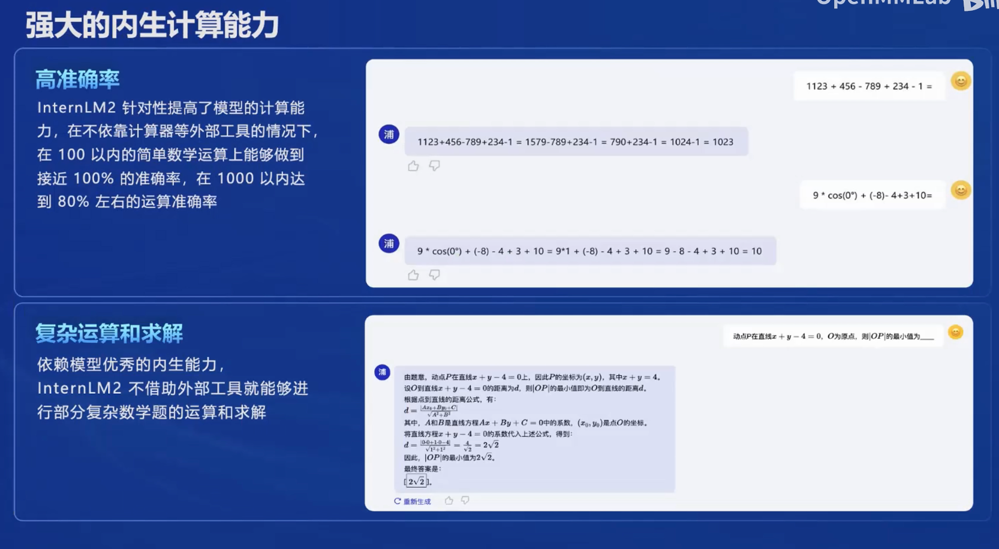
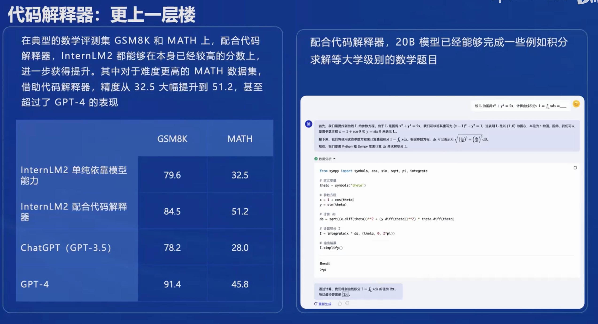
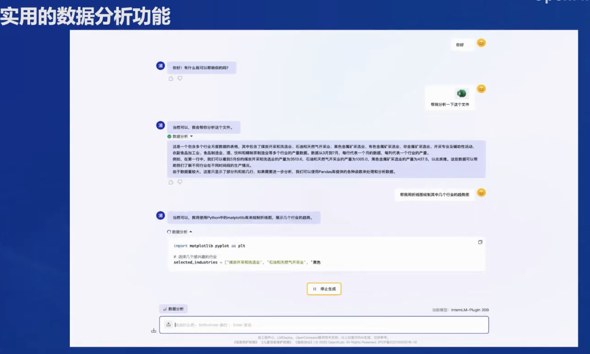
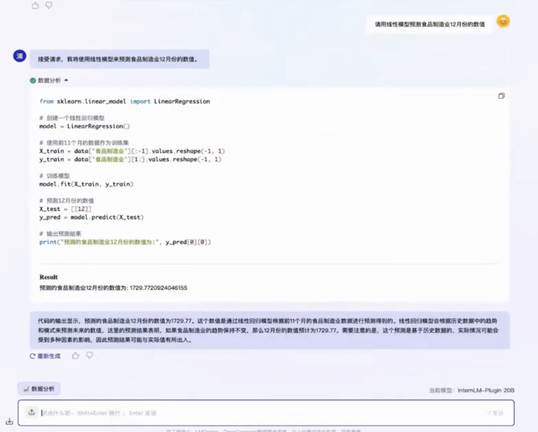
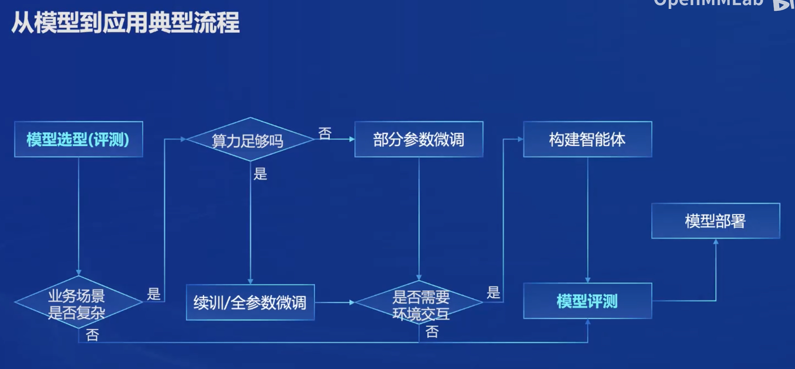
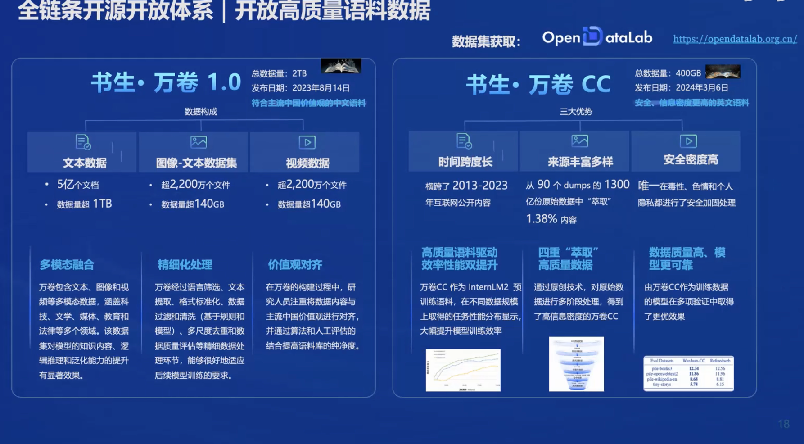
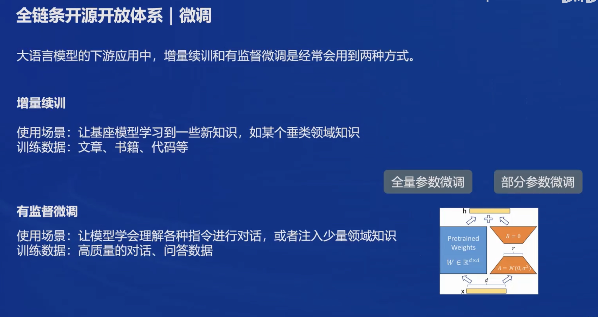

# 书生浦语大模型介绍

- [OpenCompass](https://gitee.com/open-compass/opencompass)：面向大模型评测的一站式平台
- [IMDeploy](https://gitee.com/InternLM/lmdeploy)：涵盖了 LLM 任务的全套轻量化、部署和服务解决方案的高效推理工具箱
- [XTuner](https://gitee.com/InternLM/xtuner)：轻量级微调大语言模型的工具库
- [InternLM-XComposer](https://gitee.com/InternLM/InternLM-XComposer)：浦语·灵笔，基于书生·浦语大语言模型研发的视觉-语言大模型
- [Lagent](https://gitee.com/InternLM/lagent)：一个轻量级、开源的基于大语言模型的智能体（agent）框架
- [InternLM](https://gitee.com/InternLM/InternLM)：一个开源的轻量级训练框架，旨在支持大模型训练而无需大量的依赖

## 书生浦语大模型全年度开源体系

大模型已经成为发展通用人工智能的重要途径。从本世纪初到2021年、2022年，大家的研究更多集中在专用模型上，即针对特定任务采用特定模型解决问题。例如，人工智能中有语音识别、图像分类、人脸识别、围棋比赛等任务，分别有对应的专用模型，如阿尔法fold用于预测蛋白质结构，GPT-3用于文本生成等。

然而，近两年来，学术界和工业应用越来越倾向于发展通用大模型，即一个模型能够应对多种任务和模态。例如，CHEGBT能够处理从文本到文本的各类任务，GPT-4能够解决多种跨模态任务。这种趋势下，通用大模型成为研究热点，被认为是通往通用人工智能的关键途径。

## 书生浦语大模型的开源历程

书生浦语大模型自去年6月份首次发布以来，一直保持快速迭代。7月份，千亿参数大模型全面升级，支持8K语境和26种语言。同时，上海重点实验室推出了全免费商用的7B开源模型和全链条工具体系。8月份发布了书生万卷1.0多模态预训练语料库，后续发布了升级版对话模型和开源智能体框架，支持intern LM2的升级转换。上海重点实验室发布了123B迁移参数模型，9月份发布了中等尺寸的开源模型，并升级了开源工具链。

今年1月17号，internLM2正式开源，相比第一代模型有了显著提升，能够解决更多真实问题和复杂场景。书生浦语2.0面向不同使用需求，提供了不同尺寸和类型的模型。上海重点实验室提供了7B轻量级模型，适用于轻量级研究和应用；20B综合性能更强的重量级模型，适用于复杂场景。每个尺寸的模型都包括intimal base、Inte2和chat三个不同模型。internLM2 base是高质量、强可塑性的模型基座，在其基础上强化了多个能力方向，取得了优异的评测成绩和通用语言能力。internLM2模型推荐用于下游进一步微调。同时，上海重点实验室还有internLM2chat模型，在base模型基础上经过优化，面向对话交互。internLM2chat模型具备良好的指令遵循、共情、聊天和调用工具能力。

上海重点实验室将所有模型面向社区开源，用户可以根据实际场景和需求选用。internLM2 M2的初心是回归语言建模本质，通过高质量语料和新一代数据清洗过滤技术提升模型能力。上海重点实验室通过高质量语料驱动的数据负极方式，从互联网和语料库中复习更多类似语料，并针对性补齐新数据，加强模型在世界知识、梳理代码等核心能力上的差异。

## 书生浦语2.0的主要亮点

书生浦语2.0具备超长上下文能力，支持200,000 token长度，实现**大海捞针**测试(长语料里加入无关的信息 ,然后针对这些信息提问 )，综合能力全面提升。20B模型在重点评测上可比肩GPT-3.5。模型具备优秀的对话和创作体验，如指定遵循能力、结构化创作能力。在APAA1V评测上超过GPT-3.5和Gemini Pro，工具调用能力得到升级，支持复杂智能体搭建。模型强化了内生计算能力，不借助外部工具或计算器，具备准确计算能力。通过加入代码解释器，在JS8K和max数学评测集上达到GPT-4水平。

- 数据分析功能 (还可以接着让他 调用sklearn 模型 预测)

- 还可以接着让他 调用sklearn 模型 预测

## 从模型到应用的流程分析

从模型到最终应用，需要经过模型选型、业务场景微调、智能体构建、模型评测、部署上线等多个步骤。每个环节都需要大量代码开发和工具选择。为了简化这一流程，上海重点实验室开发了书生浦语全链条工具体系，覆盖数据、预训练、微调、部署、评测、应用等环节。

##### 数据语料

 ##### 模型选型

- 根据业务需求选择合适的书生大模型，考虑模型规模、性能和成本。
- 轻量级模型适合资源受限场景，重量级模型适合复杂任务处理。
	- 对于资源受限的场景，可以选择7B模型；
	- 而对于需要处理更复杂任务的场景，则可能需要选择20B模型。
	- 书生大模型支持多种语言和多模态能力，这在选择模型时也需要考虑。

##### 业务场景微调
- 使用XTuner微调框架对选定的模型进行有监督或无监督微调。
- 微调使模型适应特定行业知识或业务流程。

###### ZeRO优化器

- **Zero Redundancy Optimizer (ZeRO)**：采用多种策略降低内存占用，包括分片和复制参数。

- https://www.microsoft.com/en-us/research/blog/zero-deepspeed-new-system-optimizations-enable-training-models-with-over-100-billion-parameters/

  

##### 智能体构建
- 利用lagend和agentLego框架构建多功能智能体。
- 智能体能够理解指令、进行对话和执行任务。

##### 模型评测
- 通过OpenCompass评测体系对模型进行多维度评测。 

  - CompassHub：高质量评测基准社区

- 评测确保模型在语言理解、推理和交互体验等方面的表现。

  

##### 部署上线
- 使用LMDeploy工具链进行模型部署，优化推理速度和资源使用。
	- LMDeploy支持多种访问接口，如Python接口、RESTful接口和gRPC接口，使得模型可以轻松集成到现有的系统中
- 部署后持续监控模型性能，确保服务的稳定性和可靠性。

###### 长上下文处理：

- 为了处理长文本，InternLM2在预训练的第二阶段使用了长达32,000个token的上下文窗口。这通过扩展模型的上下文理解能力，使得模型能够处理更复杂的任务，如长篇文章的理解和生成。
- 实现长上下文处理的关键在于模型的架构设计，InternLM2采用了Grouped-Query Attention（GQA）机制，这使得模型能够在保持高速度的同时处理非常长的序列，同时保持较低的GPU内存使用。
- 在训练过程中，通过逐步增加序列长度，模型能够适应更长的文本，并在长上下文条件下进行有效的学习和推理。

##### 对齐 

LHF 大语言模型对齐方法，它通过结合人类反馈来学习获得符合人类偏好的奖励模型，并使用近端策略优化（PPO）为模型提供奖励信号，使模型能够更好地理解和执行传统方法难以定义的任务。但是，在应用中仍然存在以下问题：

1. 偏好冲突 **Preference Conflict**：Helpful, Harmless, Honest 目标间相互矛盾。
2. 奖励黑客 **Reward Hacking**：模型可能会学会通过捷径欺骗奖励系统以获得高分。

Conditional Online RLHF (Cool RLHF) 对于上述两个问题分别给出了解决方案，对于偏好冲突，Cool RLHF 首先引入了一个条件奖励机制来调和多样化的偏好，使其能够根据特定条件给不同的偏好动态分配 Attention， 从而整合多个偏好。此外，Cool RLHF 采用了多轮在线  RLHF 策略，减轻奖励黑客行为的发生。

###### Online RLHF

在线强化学习来自人类反馈（Online RLHF）是一种训练大型语言模型（LLM）的方法，旨在使模型更好地适应人类用户的反馈，以改善其对话和决策能力。这种方法特别关注于实时地调整模型的行为，以响应最新的人类评价。

## 

## 开源工具体系介绍

上海重点实验室在数据方面有书生万卷开源数据集，预训练方面有InternLM-Train 框架，微调方面有XTuner框架，部署方面开源了LMDeploy工具，评测方面开源了openCompass司南评测体系，智能体应用方面开源了legend和agentlego框架和工具箱。

