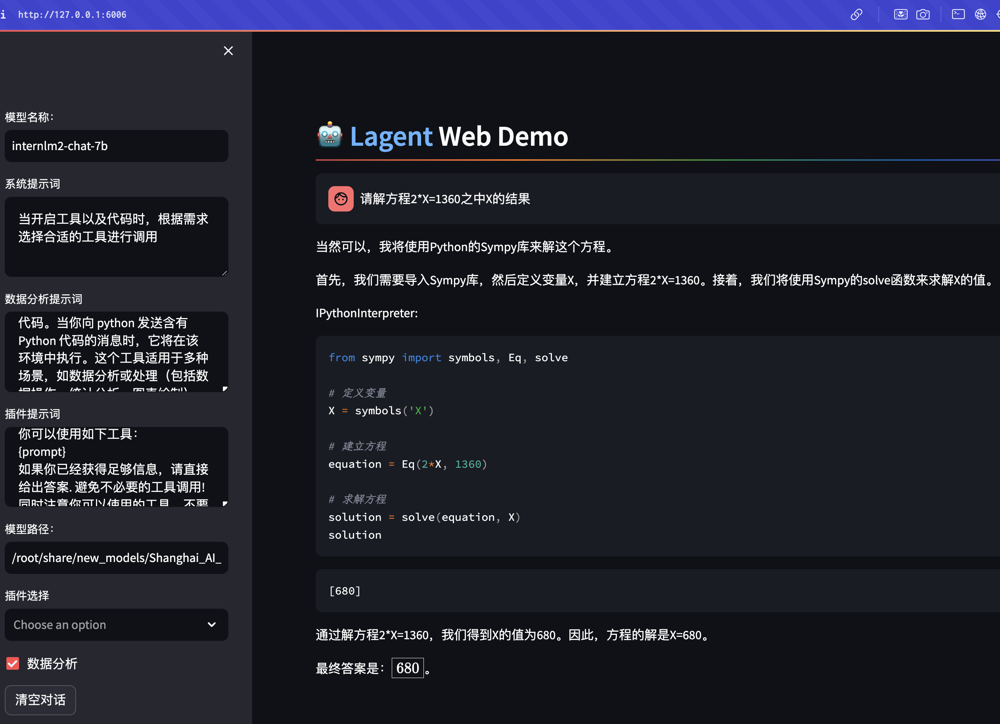
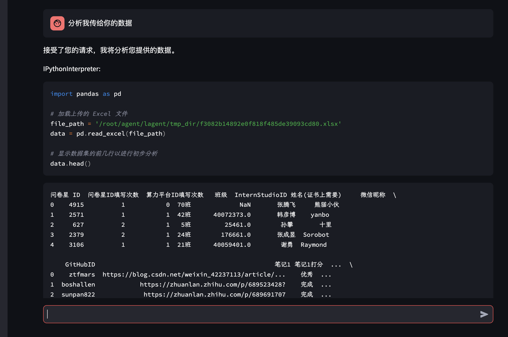
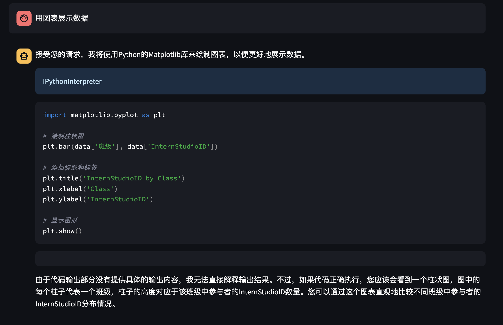

# 基础作业 (结营必做)

##  1 使用 `InternLM2-Chat-1.8B` 模型生成 300 字的小故事（需截图）

>  [参考官方文档](https://github.com/InternLM/Tutorial/blob/camp2/helloworld/hello_world.md)


<details>
           <summary style="font-size:20"> 代码 </summary> 


  [cli_demo.py](./python/cli_demo.py)

</details>

> 例子 代码是没有加入 上下文history ,所以没有多轮会话的能力 


## 2 使用[书生·浦语 Web](https://internlm-chat.intern-ai.org.cn/) 和浦语对话，和书生·浦语对话，并找到书生·浦语 1 处表现不佳的案例(比如指令遵循表现不佳的案例)，提交到[问卷](https://aicarrier.feishu.cn/share/base/form/shrcn9l8Di10nz4xmheh3LLJfJd)

>  我的 问卷  https://aicarrier.feishu.cn/share/base/form/shrcn9l8Di10nz4xmheh3LLJfJd


# **进阶作业 (优秀学员必做)**

##  1.下载模型 


- huggingface 熟悉 `huggingface` 下载功能，使用 `huggingface_hub` python 包，下载 `InternLM2-Chat-7B` 的 `config.json` 文件到本地（需截图下载过程
```python

import os 
from huggingface_hub import hf_hub_download  # Load model directly 

hf_hub_download(repo_id="internlm/internlm2-7b", filename="config.json")

```

- modelscope

```python
import os
from modelscope.hub.snapshot_download import snapshot_download

# 创建保存模型目录
os.system("mkdir /root/models")

# save_dir是模型保存到本地的目录
save_dir="/root/models"

snapshot_download("Shanghai_AI_Laboratory/internlm2-chat-1_8b", 
                  cache_dir=save_dir, 
                  revision='v1.1.0')


```


##  2.灵笔 完成 `浦语·灵笔2` 的 `图文创作` 及 `视觉问答` 部署（需截图） 

#### 1 图文写作实战（开启 50% A100 权限后才可开启此章节）
> 个人感觉很不错 实用性很高
>大概看了一下代码  ,他是调用internLM 模型  选择在哪插入图片, 插入什么图片, 然后去一个网址 找符合要求的图片 .


#### 5.4 图片理解实战
- 测试了几次 作为OCR使用 , 开头40字左右 准确率很高,后面就有点自由发挥... 试过 调大默认的参数 ,会产生大量的重复.


## 3 完成 `Lagent` 工具调用 `数据分析` Demo 部署（需截图）





- 分析excel 数据 



- 画图是 得在 jupyter ? 这个怎么搞......




##  运行微调虚拟人模型  八戒-Chat-1.8B 模型

- 八戒-Chat-1.8B：https://www.modelscope.cn/models/JimmyMa99/BaJie-Chat-mini/summary
- Chat-嬛嬛-1.8B：https://openxlab.org.cn/models/detail/BYCJS/huanhuan-chat-internlm2-1_8b
- Mini-Horo-巧耳：https://openxlab.org.cn/models/detail/SaaRaaS/Horowag_Mini

<details>
           <summary style="font-size:20">代码</summary>


​        

```python
from transformers import AutoTokenizer, AutoModelForCausalLM, GenerationConfig
import torch

model_name_or_path = "八戒-Chat模型地址"

tokenizer = AutoTokenizer.from_pretrained(model_name_or_path, trust_remote_code=True)
model = AutoModelForCausalLM.from_pretrained(model_name_or_path, trust_remote_code=True, torch_dtype=torch.bfloat16).cuda()
model.eval()  

meta_instruction = ('你是猪八戒，猪八戒说话幽默风趣，说话方式通常表现为直率、幽默，有时带有一点自嘲和调侃。'
                        '你的话语中常常透露出对食物的喜爱和对安逸生活的向往，同时也显示出他机智和有时的懒惰特点。'
                        '尽量保持回答的自然回答，当然你也可以适当穿插一些文言文，另外，书生·浦语是你的好朋友，是你的AI助手。')
                        
response, history = model.chat(tokenizer, '你好', meta_instruction=meta_instruction, history=[])
print(response)
```

</details>


## 


# 笔记

### **初步介绍 Lagent 相关知识**


## 6 **附录**

- 当我们建立安全链接之后，如果想要将其删除可以选择以下命令：

```
unlink link_name
```


## [浦语·灵笔2](https://gitee.com/internlm/InternLM-XComposer)

**浦语·灵笔2**是基于[书生·浦语2](https://gitee.com/link?target=https%3A%2F%2Fgithub.com%2FInternLM%2FInternLM%2Ftree%2Fmain)大语言模型研发的突破性的图文多模态大模型，具有非凡的图文写作和图像理解能力，在多种应用场景表现出色：

我们开源的 浦语·灵笔2 包括两个版本:

- **InternLM-XComposer2-VL-7B**  基于书生·浦语2-7B大语言模型训练，面向多模态评测和视觉问答。浦语·灵笔2-视觉问答-7B是目前最强的基于7B量级语言模型基座的图文多模态大模型，领跑多达13个多模态大模型榜单。
- InternLM-XComposer2-7B 进一步微调，支持自由指令输入图文写作的图文多模态大模型。
- 更多方法细节请参考[技术报告](https://gitee.com/link?target=https%3A%2F%2Farxiv.org%2Fabs%2F2401.16420)．


```
git clone https://gitee.com/internlm/InternLM-XComposer.git

```


- 支持上传图片生成 文稿


