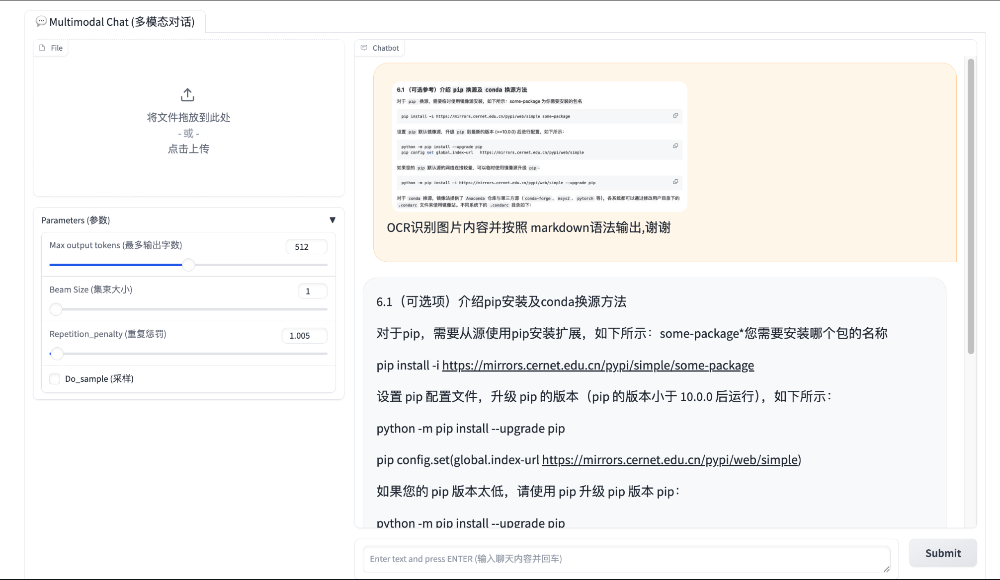

# 基础作业 (结营必做)

##  1 使用 `InternLM2-Chat-1.8B` 模型生成 300 字的小故事（需截图）

>  [参考官方文档](https://github.com/InternLM/Tutorial/blob/camp2/helloworld/hello_world.md)


<details>
           <summary style="font-size:20"> 代码 </summary> 


  [cli_demo.py](./python/cli_demo.py)

</details>

> 例子 代码是没有加入 上下文history ,所以没有多轮会话的能力 


## 2 使用[书生·浦语 Web](https://internlm-chat.intern-ai.org.cn/) 和浦语对话，和书生·浦语对话，并找到书生·浦语 1 处表现不佳的案例(比如指令遵循表现不佳的案例)，提交到[问卷](https://aicarrier.feishu.cn/share/base/form/shrcn9l8Di10nz4xmheh3LLJfJd)

>  我的 问卷  https://aicarrier.feishu.cn/share/base/form/shrcn9l8Di10nz4xmheh3LLJfJd


# **进阶作业 (优秀学员必做)**

##  1.下载模型 


- huggingface 熟悉 `huggingface` 下载功能，使用 `huggingface_hub` python 包，下载 `InternLM2-Chat-7B` 的 `config.json` 文件到本地（需截图下载过程
```python

import os 
from huggingface_hub import hf_hub_download  # Load model directly 

hf_hub_download(repo_id="internlm/internlm2-7b", filename="config.json")

```

- modelscope

```python
import os
from modelscope.hub.snapshot_download import snapshot_download

# 创建保存模型目录
os.system("mkdir /root/models")

# save_dir是模型保存到本地的目录
save_dir="/root/models"

snapshot_download("Shanghai_AI_Laboratory/internlm2-chat-1_8b", 
                  cache_dir=save_dir, 
                  revision='v1.1.0')


```


##  2.灵笔 完成 `浦语·灵笔2` 的 `图文创作` 及 `视觉问答` 部署（需截图） 

#### 1 图文写作实战（开启 50% A100 权限后才可开启此章节）
> 个人感觉很不错 实用性很高
>大概看了一下代码  ,他是调用internLM 模型  选择在哪插入图片, 插入什么图片, 然后去一个网址 找符合要求的图片 .


#### 5.4 图片理解实战
- 测试了几次 作为OCR使用 , 开头40字左右 准确率很高,后面就有点自由发挥... 试过 调大默认的参数 ,会产生大量的重复.




## 3 完成 `Lagent` 工具调用 `数据分析` Demo 部署（需截图）


- 分析excel 数据 


- 画图是 得在 jupyter ? 这个怎么搞......


​        


 


