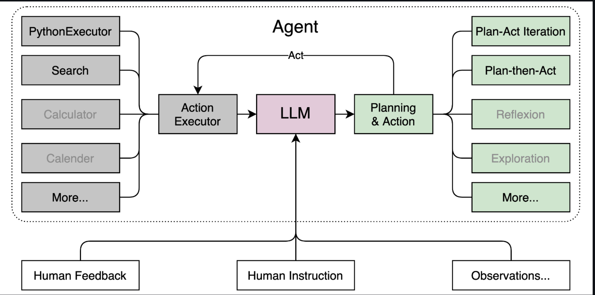

# 笔记


### **初步介绍 Lagent 相关知识**




##  **附录**知识

- 当我们建立安全链接之后，如果想要将其删除可以选择以下命令：

```
unlink link_name
```


## [浦语·灵笔2](https://gitee.com/internlm/InternLM-XComposer)

**浦语·灵笔2**是基于[书生·浦语2](https://gitee.com/link?target=https%3A%2F%2Fgithub.com%2FInternLM%2FInternLM%2Ftree%2Fmain)大语言模型研发的突破性的图文多模态大模型，具有非凡的图文写作和图像理解能力，在多种应用场景表现出色：

我们开源的 浦语·灵笔2 包括两个版本:

- **InternLM-XComposer2-VL-7B**  基于书生·浦语2-7B大语言模型训练，面向多模态评测和视觉问答。浦语·灵笔2-视觉问答-7B是目前最强的基于7B量级语言模型基座的图文多模态大模型，领跑多达13个多模态大模型榜单。
- InternLM-XComposer2-7B 进一步微调，支持自由指令输入图文写作的图文多模态大模型。
- 更多方法细节请参考[技术报告](https://gitee.com/link?target=https%3A%2F%2Farxiv.org%2Fabs%2F2401.16420)．


```
git clone https://gitee.com/internlm/InternLM-XComposer.git

```


- 支持上传图片生成 文稿


