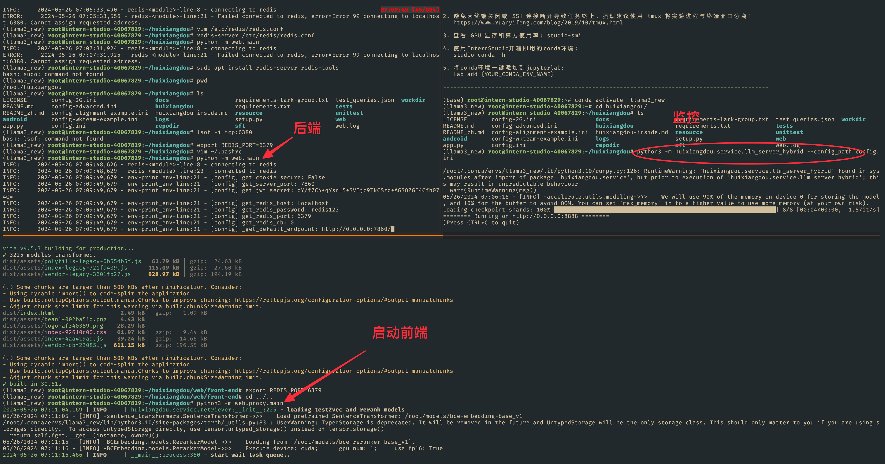
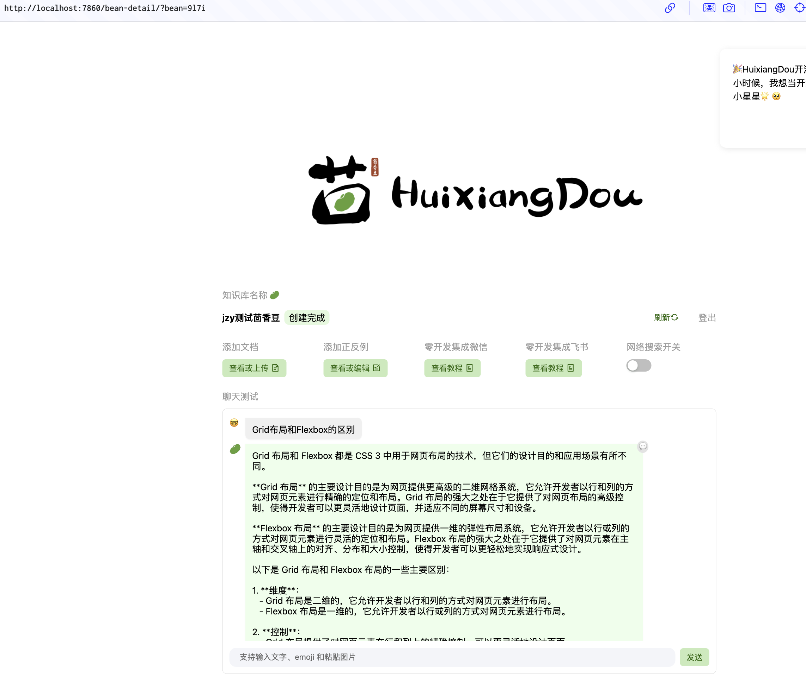

## 基础作业 - 任意选一个作业


### 1. 在[茴香豆 Web 版](https://openxlab.org.cn/apps/detail/tpoisonooo/huixiangdou-web)中创建自己领域的知识问答助手


- 参考视频[零编程玩转大模型，学习茴香豆部署群聊助手](https://www.bilibili.com/video/BV1S2421N7mn)
- 完成不少于 400 字的笔记 + 线上茴香豆助手对话截图(不少于5轮)

- （可选）参考 [代码](https://github.com/InternLM/HuixiangDou/tree/main/web) 在自己的服务器部署茴香豆 Web 版


- 一共要启动三个终端 
  
  <details>
             <summary style="font-size:20">bash 命令</summary>
  
   ```bash
   python3 -m huixiangdou.service.llm_server_hybrid --config_path config.ini
   
   python3 -m web.proxy.main
   python -m web.main
   
   ```
  
  </details>
  
  
  
  - 需要配置redis (lstuido 运行 不能加sudo .., 也能跑, redis端口号需要改)



- 前端页面 



-  测试网页版发现的问题 (新手, 不熟, 需要多看看文档)
   -  感觉打开 网络搜索 开关后不是很聪明, 可能是用服务器部署, 不能访问外网? 
   -  询问excel 表格内容也不是很聪明, 需要再看看文档 .
   -  感觉处理上传文档也挺费时间  ,因为需要 做 tokensize ? 


### 2.在 `InternLM Studio` 上部署茴香豆技术助手


- 根据教程文档搭建 `茴香豆技术助手`，针对问题"茴香豆怎么部署到微信群？"进行提问
- 完成不少于 400 字的笔记 + 截图

 

茴香豆 做智能问答, 

- 配置 good_questions.json
- 配置 bad_questions.json
- 每次对问题评分 ,拒绝评分低的, 回复评分高的  


- 命令行评估测试 
```bash
# 创建向量数据库存储目录
cd /root/huixiangdou && mkdir workdir 

# 分别向量化知识语料、接受问题和拒绝问题中后保存到 workdir
python3 -m huixiangdou.service.feature_store --sample ./test_queries.json

```


- 命令行问答
```bash
# 填入问题
sed -i '74s/.*/    queries = ["huixiangdou 是什么？", "茴香豆怎么部署到微信群", "今天天气怎么样？"]/' /root/huixiangdou/huixiangdou/main.py

# 运行茴香豆
cd /root/huixiangdou/
python3 -m huixiangdou.main --standalone

```


### 利用 Gradio 搭建网页 Demo

- 利用 Gradio 搭建网页 Demo
```bash
cd /root/huixiangdou
python3 -m tests.test_query_gradio 

```


